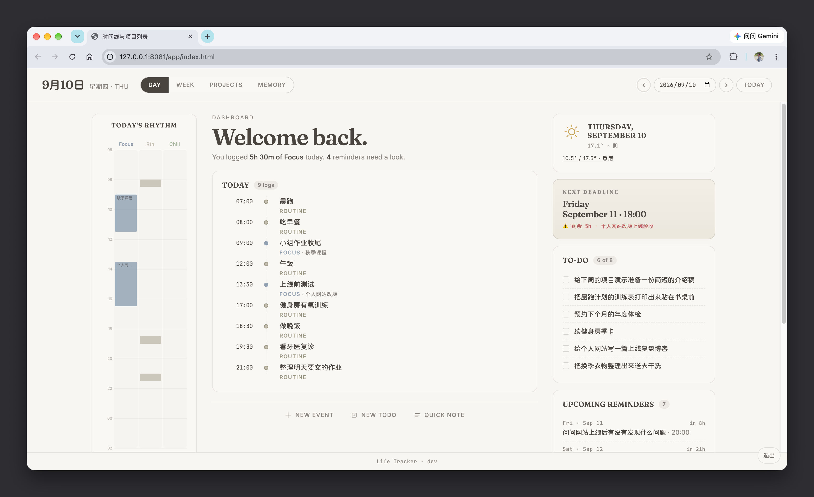
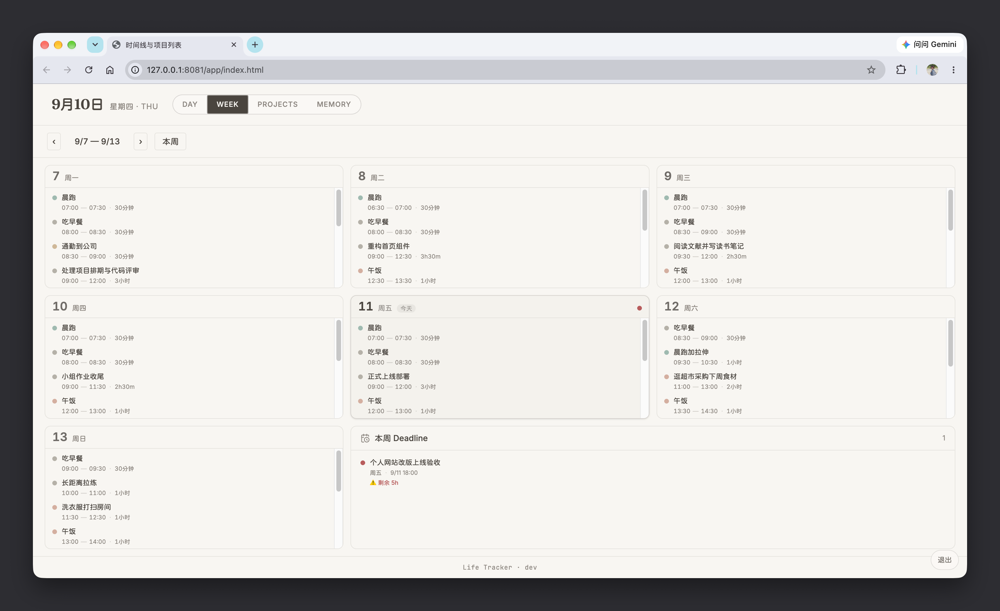
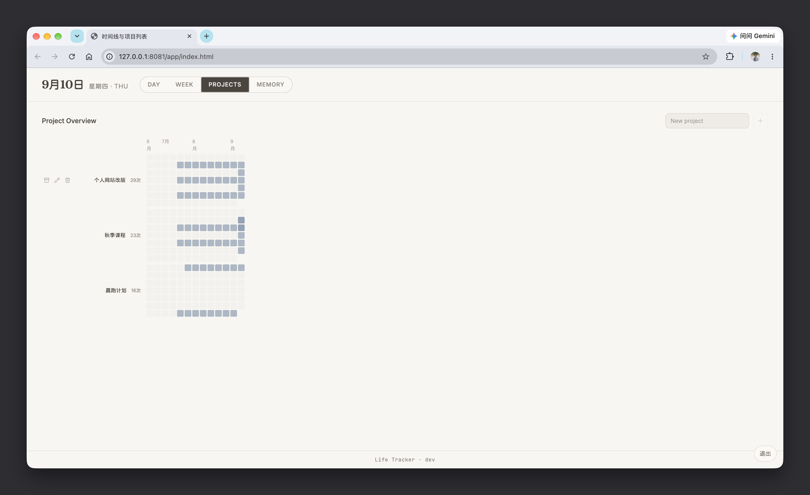
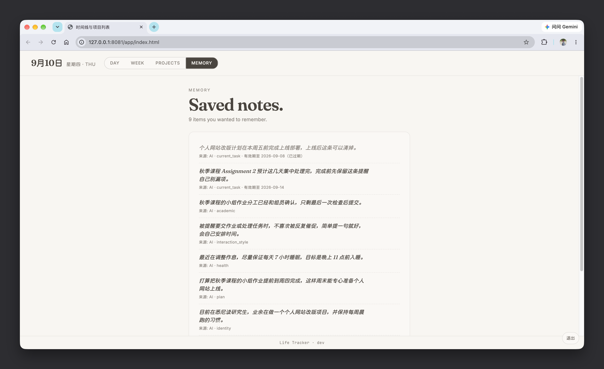
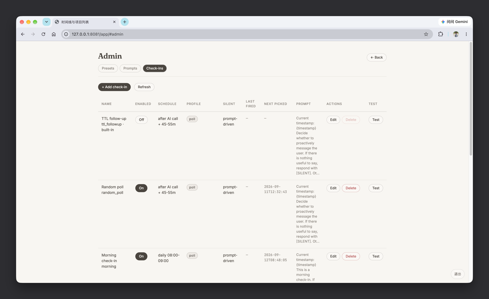
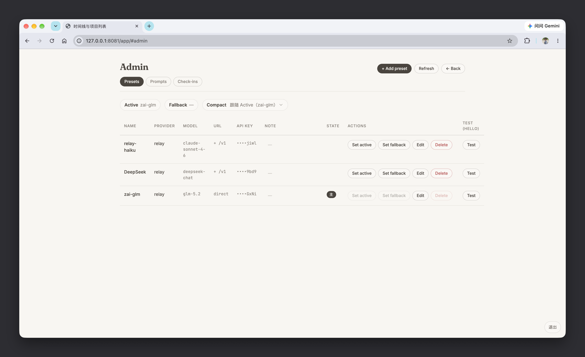

# Life Tracker

[](LICENSE)

A self-hosted personal AI assistant that talks with you through Discord while quietly keeping track of your life in the background.

Instead of asking you to manually maintain a planner, journal, task manager, and activity log, Life Tracker extracts useful information from ordinary conversations and turns it into structured personal state.

It is currently designed as a **single-user, self-hosted system**.



---

## What can it do?

### 🕓 Build your timeline automatically

Just talk normally.

Life Tracker can recognize activities, plans, events, and changes in your day and turn them into structured timeline entries.

The web dashboard visualizes this information as a daily and weekly timeline, so you can look back and see how your time was actually spent without manually logging every activity.



### 💬 Talk through Discord

Discord is the main conversational interface.

You can use the assistant like a normal chatbot while it has access to selected real-world context such as:

- your recent conversation history
- today's timeline
- upcoming deadlines
- reminders and todos
- Google Calendar events
- current weather
- persistent memory

This allows conversations to be grounded in what is actually happening in your day rather than existing as isolated chat sessions.

### ✅ Track todos, deadlines, and follow-ups

Life Tracker can automatically create structured tasks and deadlines from conversations.

It can also create short-term follow-ups when something should be revisited later.

For example:

> “I want to drink some water, but I need to finish this first.”

The conversation itself can continue normally, while the background system creates a follow-up to check again a few minutes later.

You do not need to explicitly say:

> “Create a reminder for five minutes from now.”

### 📊 Track project activity

Focus and project-related activity can be recorded separately.

The dashboard can visualize project activity using views such as:

- activity heatmaps
- weekly activity
- project timelines
- focus history

This makes it possible to see not only *what* you worked on, but also how consistently a project has been active over time.



### 🔔 Send proactive messages

The assistant does not need to wait for you to start every conversation.

Configurable routines can allow it to message you at particular times or after particular intervals.

For example:

- morning planning
- evening reflection
- checking unfinished tasks
- checking in after a long period of inactivity
- reminding you about something mentioned earlier
- reacting to upcoming calendar events

A routine can also decide that nothing useful needs to be said and remain silent.

### 🧠 Persistent memory

Life Tracker includes an evolving memory system for preserving useful context beyond the immediate conversation window.

The memory subsystem is still under development and its behaviour may change as the project evolves.



---

## Customization

Life Tracker is intentionally designed around a customizable AI layer rather than one hard-coded assistant personality.

### ✏️ Custom prompts

The assistant's system prompts can be edited directly from the Admin UI.

Runtime information can be injected into configurable positions inside your prompt, including information such as:

- memories
- relevant conversation history
- timeline
- reminders
- deadlines
- projects
- weather
- calendar events
- available tools

This means you can bring your own prompt structure and decide how the assistant should interpret the information Life Tracker provides.

The prompts included with the repository are intended as defaults and examples rather than the only supported behaviour.

### ⏰ Custom routines

Proactive routines are configurable individually.

For each routine, you can control things such as:

- when it is active
- how often it may run
- the interval between messages
- what context it receives
- what prompt it uses
- whether it is allowed to stay silent

This makes routines usable for much more than fixed reminders.

They can act more like small scheduled AI behaviours.



### 🤖 Bring your own model and API

Life Tracker is not tied to one AI provider.

Model presets and API endpoints can be configured so the system can use supported providers or OpenAI-compatible relay endpoints.

This is useful if you want to:

- use your own API keys
- switch between models
- use a relay or gateway
- assign different models to different workloads
- configure fallback models



### ♻️ Prompt-cache keep-alive

Life Tracker can optionally generate periodic AI calls to help keep a provider's prompt cache active.

For providers that support prompt caching with a time-to-live window, this can be useful when the assistant is used irregularly.

Instead of allowing the cached prompt prefix to expire between interactions, a configurable keep-alive interval can make a lightweight request before the TTL expires.

Depending on the provider and its caching policy, this may reduce repeated prompt processing, cache misses, and input-token cost.

This behaviour is optional and can be disabled completely.

### 🌤️ External context

Optional integrations currently include:

**Google Calendar**

The assistant can read upcoming calendar events and use them as conversational context.

**Weather**

Current weather information can be included in the assistant's runtime context so conversations can take the user's physical environment into account.

---

## How does it work?

A normal AI chatbot usually follows a single loop:

```text
User message
    ↓
LLM
    ↓
Reply
```

This becomes awkward once the same model is also expected to maintain databases, create reminders, update timelines, decide what should be remembered, and still produce a natural conversational response.

Life Tracker separates these responsibilities.

### Dual-track execution

A conversation can conceptually follow two parallel paths:

```text
                        ┌──→ Conversation Track ──→ Discord reply
User message ───────────┤
                        └──→ Background Track ────→ Life state
                                                    │
                                                    ├─ Timeline
                                                    ├─ Todos
                                                    ├─ Deadlines
                                                    ├─ Follow-ups
                                                    └─ Memory
```

The **conversation track** is responsible for talking to the user.

The **background track** examines what happened and decides whether structured state should be created or updated.

The user therefore does not need to phrase ordinary life events as commands.

You can simply talk.

### Context is assembled at runtime

Before an AI call, Life Tracker can assemble relevant context from several sources:

```text
Conversation
     +
Recent / relevant history
     +
Timeline
     +
Deadlines & reminders
     +
Memory
     +
Google Calendar
     +
Weather
     ↓
Runtime Prompt
     ↓
Model
```

Only the conversation itself is inherently conversational.

The rest is structured state that can persist independently from an individual chat session.

### Conversation is only one interface to the state

This is the main idea behind the project.

Life Tracker treats the conversation as an interface to an ongoing personal state rather than treating the chat transcript itself as the entire world.

The assistant can talk to you, observe changes in that state, update it in the background, and later use that state when deciding what is relevant to say.

---

## Installation

Life Tracker is intended to run as a self-hosted Docker application.

### 1. Clone the repository

```bash
git clone https://github.com/nctlcnt/life_tracker.git
cd life_tracker
```

### 2. Create your configuration

```bash
cp config.example.json config.json
```

Configure the required values, including:

- Discord bot token
- allowed Discord user
- Discord channel
- AI provider / endpoint
- model preset
- timezone

Optional integrations such as Google Calendar and weather can be configured separately.

### 3. Configure the dashboard API key

Set a sufficiently long application API key in your environment:

```bash
LIFE_TRACKER_API_KEY=your-secret-key
```

For local HTTP development:

```bash
LIFE_TRACKER_COOKIE_SECURE=false
```

### 4. Start with Docker

```bash
make dev
```

Then open:

```text
http://localhost:8080
```

Useful commands:

```bash
make logs
make build
make down
```

### Debugging

Life Tracker includes a detailed AI trace interface in the dashboard.

When developing prompts, tools, background execution, or model routing, traces can be used to inspect individual AI operations and understand how a result was produced.

This is especially useful when debugging the asynchronous conversation/background pipeline: instead of relying only on application logs, you can inspect the AI execution path directly from the UI.

---

## Open source

Life Tracker is a personal project built primarily for experimentation with persistent, context-aware personal AI systems.

The public repository contains the application itself and generic/default configuration intended to make self-hosting possible.

Personal data, credentials, runtime databases, OAuth credentials, and private prompt customizations should not be committed to the repository.

The project is under active development. APIs, database structures, prompts, and memory behaviour may change between versions.

Contributions, experiments, and forks are welcome subject to the repository's license.

### License

Life Tracker is licensed under the [GNU Affero General Public License v3.0](LICENSE) (AGPL-3.0).

This means that if you modify Life Tracker and run it as a network service that other people can interact with, you are required to make the source code of your modified version available to those users under the same license. See the [LICENSE](LICENSE) file for the full terms.

Copyright (C) 2026 nctlcnt