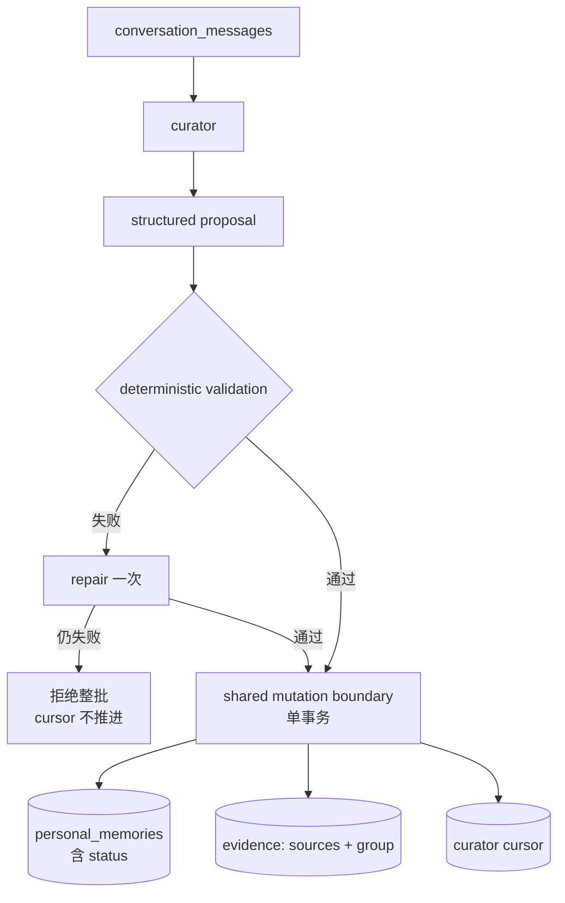
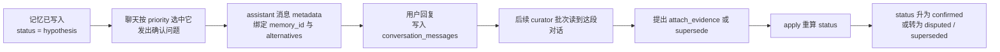

# Memory v4 architecture design

> 文档性质：living architecture design，描述当前认可的目标结构，并明确标出实现状态。
> 术语以 [GLOSSARY.md](../GLOSSARY.md) 为准；本文与术语表冲突时改本文。
> 已经发生的实现演进见 [DEVELOPMENT-LOG.md](../DEVELOPMENT-LOG.md)，施工顺序见
> [memory-v4-implementation.md](memory-v4-implementation.md)。
>
> 最后核对：2026-08-22（按 2026-07-23 的单表状态阶梯方向重写）

## 1. 这份文档解决什么问题

Memory v4 要把三件过去容易混在一起的事分开：

1. 保持一段对话的连续性；
2. 保存关于用户当前仍成立的长期信息；
3. 保留得出这些信息的原始证据和演变历史。

系统的信任边界是：**模型可以整理、归纳和提出修改，但模型输出本身不构成用户事实。
每一条记忆都必须能追溯到具体的原始消息；模型推断出的 claim 可以作为记忆条目存在，
但只能停在低 status，因而只拥有受限的注入权限，不能被当作用户确认过的事实使用。
把一条推断提升为可断言的事实，只能由用户确认事件驱动，证据数量的累积不能替代确认。**

这句话在 2026-07-23 之前的表述不同。旧表述是"模型推断出的 claim 必须先进入候选层，
经过用户确认后才能成为 canonical memory"。旧表述已经作废，理由见下一节。

### 1.1 相对上一版的方向变化

上一版设计有三个结构，本版全部取消：

| 旧结构 | 取消原因 | 现在由什么承担 |
|---|---|---|
| candidate layer（`memory_candidates` 独立表） | 候选与正式记忆需要两套 status 枚举、两套查重、两套 apply 路径，而它们描述的是同一件事在不同可信度下的样子 | 同一张 `personal_memories` 表，用 `status` 阶梯区分可信度 |
| claim 路由（asserted 走正式表、inferred 走候选表） | 路由把"证据关系"和"存储位置"绑死，导致同一条记忆随证据变化要跨表搬家 | `basis` 保留为字段，只描述证据与 claim 的关系；它参与计算 `status`，但不决定存哪张表 |
| evidence group 三张独立表 | 组身份是 curator 每次操作的 `sources[]` 天然形成的，不需要为它单独建一层可被外部引用的实体 | evidence group 仍然是独立证据的计数单位，但作为 `personal_memory_sources` 上的一个组标识存在（见第 6 节） |

需要说清楚的是：**取消的是"独立候选层"和"跨表路由"，不是 evidence group 这个概念，
也不是 `basis` 这个字段。** 证据组仍然是判断"这是几份独立证据"的唯一单位；`basis`
仍然是记忆条目上的必填字段。

方向变化的直接原因是 2026-07-22 前后人工审查 curator 真实输出时发现的情况：
同一条记忆在连续几批消息里会依次表现为推断、有支持、被用户直接确认。在双表设计下，
这条记忆要先在候选表建立、再删除、再在正式表重建，而它的证据链必须跨表拼接。
单表状态阶梯让同一行的 `status` 随证据变化而升降，证据链始终挂在同一个 `memory_id` 上。

## 2. 当前实现状态

Memory v4 尚未完整落地。阅读后续目标设计时，必须区分以下状态：

| 能力 | 状态 | 当前事实 |
|---|---|---|
| Recent context + compact | 已实现 | 原始消息在 `conversation_messages`；compact summary 与折叠游标在 `app_state` |
| compact 后历史 embedding / `search_history` | 已实现 | 只为已折叠区间异步补向量，聊天可检索历史 |
| curator propose / validate / apply | 已实现 | 支持 dry-run、严格 JSON 与 quote 校验、单事务写入并推进 cursor |
| curator scheduler 的 shadow / auto-apply 开关 | 部分实现 | 配置开关存在且默认关闭；尚未在生产受控开启过 |
| `personal_memories` + 扁平 `personal_memory_sources` | 已实现，但尚未成为聊天读取源 | curator 可以写入，聊天 prompt 与检索都还没有消费它 |
| `data/memory.md` + `MemoryService` | 现行聊天读取源 | 仍负责 bot 工具 CRUD 与 prompt 注入，是迁移中的旧路径 |
| 状态阶梯所需字段 | 未实现 | 表里没有 `basis`、`scope`、`stability`、`gap`、`alternatives`；`status` 的 `CHECK` 仍是 `active / superseded / archived` |
| 证据组标识与 `is_assertion` | 未实现 | `personal_memory_sources` 的主键是 `(memory_id, conversation_message_id, evidence_role)`，没有组标识，也无法表达组内角色 |
| 事后确认循环 | 未实现 | 没有 ask 的 metadata 绑定、没有 `last_asked_at` / `ask_count`、没有按 status 分档的注入 |
| consolidation 聚类与 lineage | 未实现 | 无专用 user-event embedding、聚类任务或 run snapshot |

还有三处命名与目标设计不一致，迁移时需要一并处理，不要在新文字里假装它们已经一致：

- 表里的列名是 `summary`，术语表规定的名字是 `claim`；
- 表里的列名是 `curator_model`，而 curator 身份的键应当是 `curator_name`（模型加 preset
  加 prompt 版本的组合，见第 10 节）；
- 表里有一个 `reason` 列，保存"为什么记住"，是给用户看的管理字段。它与术语表里的
  `gap`（证据缺口）不是一回事，两者需要并存，不能互相替代。

因此，`personal_memories` 是 v4 的**目标权威存储**，但它现在既不是聊天的读取源，
也还不具备表达状态阶梯所需的字段。切换完成前，新旧两条路径的边界和迁移步骤必须在
实施计划中显式管理。

## 3. 总体结构

### 3.1 四层

| 层 | 保存内容 | 回答的问题 |
|---|---|---|
| Recent context | 最近对话原文 | 我们此刻在聊什么 |
| compact | 话题轨迹、转折、指代和未完上下文 | 之前聊过什么、聊到哪里 |
| canonical store（`personal_memories`） | 关于用户当前成立的语义状态，含尚未确认的推断 | 关于用户，现在有哪些说法，各自可信到什么程度 |
| embedding | 已折叠原始消息的向量索引 | 这条记忆依据什么、用户当时怎么说的 |

这四层不能互相代替：

- compact 记录"聊过什么"，不宣称某个长期事实截至目前仍然成立；
- canonical store 记录"现在有哪些说法以及各自的可信度"，不承担对话叙事和指代连续性；
- embedding 检索找回当时怎样提到的，检索结果不自动成为当前事实。

注意 canonical store 这一层的定义与上一版不同。上一版写的是"当前有效、可复用的用户
语义状态"，隐含"表里的东西都可以当事实用"。单表方向下这句话不成立：表里同时存放
可断言的事实和只能用来提问的推断，**"canonical"指的是权威存储位置，不等于"可当事实
使用"**，后者由每一行的 `status` 单独决定。

### 3.2 写入路径

模型阶段和写入阶段必须分离。写入阶段不调用模型，也不重新解释 proposal。
`status` 在写入阶段由代码根据全部证据重新计算，模型不得提交 `status`。

推断类内容在这条路径上不再被拦截。它照常写入，只是算出来的 `status` 较低。
拦截发生在**读取侧**：低 status 的记忆拿不到"可作为事实使用"的注入权限（见第 5 节）。
这是本版设计与上一版最重要的差别——**不变量从写入闸门移到了读取权限**。

### 3.3 确认循环发生在写入之后

上一版把用户确认放在写入之前，作为推断进入正式表的闸门。本版把它放在写入之后：

这个循环的关键性质是：**确认不是一条独立的状态机，而是普通的证据补充。**
用户的回答本身就是一条新的用户消息，它会像其他消息一样进入 curator 的处理区间。
系统不需要为"等待确认"维护单独的表、单独的超时和单独的重试；确认迟迟不来，
那条记忆就一直停在原来的 status，除此之外没有别的后果。

ask 的消息 metadata 绑定 `memory_id` 和 alternatives，只解决一个问题：让 curator 知道
用户在回答哪一条记忆，不必从措辞反推。用户答的是"肯定"还是"否定"，仍然由 curator
在语义层判断，并体现为它提出的 `evidence_role`（`supports` 还是 `contradicts`）或者
直接提出 `supersede`。

## 4. 记忆条目与字段

一条记忆是 `personal_memories` 的一行。任何 status 的行都是记忆条目。

| 字段 | 作用 | 谁决定 |
|---|---|---|
| `claim` | 记忆断言的那句话。必须是单一的、可独立判断真假的陈述 | curator 提出 |
| `memory_type` | 业务分类枚举 | curator 提出，枚举待定（未决问题 1） |
| `basis` | 当前全部证据与 claim 的**关系类型**：`asserted` / `supported` / `inferred` | curator 提出，validator 校验一致性 |
| `scope` | claim 覆盖的范围枚举 | curator 提出，枚举待定（未决问题 2） |
| `stability` | 时间稳定性：`temporary` / `unknown` / `stable` | curator 提出 |
| `gap` | 自然语言说明"当前证据为什么还撑不满这个 claim" | curator 提出；`basis = asserted` 时原则上为空 |
| `alternatives` | 与当前 claim 竞争的其他合理陈述，纯文本 | curator 提出 |
| `status` | 使用权等级 | **代码计算，模型不得提交** |
| `superseded_by` | 指向替代本条的新记忆 id | 代码在 supersede 时写入 |
| `reason` | 给用户看的"为什么记住" | curator 提出 |
| `priority` 相关字段（`last_asked_at`、`ask_count`） | 待确认队列排序用 | 代码维护 |

关于 `claim` 的拆分规则：如果一句总结包含两个可能拥有不同证据、不同 status 或不同
稳定性的陈述，curator 必须把它们拆成两条记忆。validator 无法用简单规则判断时，
应当拒绝该操作并记录原因，而不是自动拆分。

关于 `basis`：它是**证据关系类型，不是置信度分数**。canonical store 不保存模型自报的
置信度数字。没有校准数据和明确消费者时，这种数字不可证伪（见第 13 节的第二篇参考）。

关于 `alternatives`：它们是纯文本，**不是记忆条目**，不占 `memory_id`，不进入检索。
唯一用途是生成确认问题的选项。用户选中其中一条时，通过 `supersede` 操作把它转成
正式记忆，旧条目变为 `superseded`。

## 5. 状态阶梯与注入权限

这是本版设计的核心。`status` 有五个取值，构成一条阶梯；每个取值唯一映射到一种
注入权限。映射关系于 2026-07-23 拍板。

| `status` | 含义 | 注入权限 | 聊天可以怎么用 |
|---|---|---|---|
| `hypothesis` | 证据只够合理猜想 | `probe_only` | 只能用来生成确认问题，不得作为事实或个性化依据 |
| `provisional` | 有明显支持，但没有用户确认事件 | `hedge` | 可带限定语引用（"你之前好像提过……"），不得当作确定事实 |
| `confirmed` | 存在用户确认事件 | `assert` | 可以直接作为事实使用 |
| `disputed` | 存在未解决的硬冲突，且尚无替代 claim | `probe_only` 或 `hidden`，见下 | 分情形 |
| `superseded` | 已被新条目替代 | `hidden` | 不进入 prompt，仅供回溯 |

`disputed` 的权限分两种情形：模型推断出的软冲突，权限为 `probe_only`，值得向用户
澄清一次；用户已经明确否认过，权限为 `hidden`，不再追问，直到出现新证据才重新处理。
**这条细则本身还需要确认**（见第 12 节的说明）。

两个必须分开的轴：

- **注入权限只回答"能不能用、怎么用"。** 它由 status 唯一决定，是一个查表操作。
- **priority 只回答"先问哪一条"。** 它由相关性、新近度和已提问次数算出，
  不携带任何真值语义，与 status 和晋升无关。

把这两个轴混在一起，就会退回"用一个分数同时表示可信度和排队顺序"的老问题。

### 5.1 status 由什么驱动

`status` 在每次 apply 时由代码根据该记忆的**全部**证据重新计算，不在旧值上做增量修改。
已经确定的规则：

- `basis = asserted`，且该 assertion 构成一次用户确认事件 ⇒ `confirmed`；
- 存在未解决的硬冲突，且没有替代 claim ⇒ `disputed`；
- supersede 操作成功完成 ⇒ 旧条目 `superseded`；
- 其余情形落在 `hypothesis` 和 `provisional` 之间，**分界规则待定**（未决问题 4）。

"用户确认事件"有两条识别路径：

1. **回答确认问题。** 该记忆的某个证据组，其 assertion 消息回答的是一条 ask，
   而这条 ask 的 metadata 绑定的正是这个 `memory_id`，且 curator 给出的
   `evidence_role` 是 `supports`。
2. **自发的等价表达。** 用户没有被问，自己直接说出了与 claim 基本等价的内容，
   即 curator 判定 `basis = asserted`，且该证据组的 assertion 不依赖任何 ask。

第二条路径现在就可以走通：它只依赖 curator 的 `basis` 判定，而 `basis` 要经过
validator 的一致性校验。

第一条路径还缺一块，不能说它已经可以机械判定。`conversation_messages` 上确实有
`reply_to_message_id`，但它存的是 Discord 的平台 message id，不是内部 id，
要经 `discord_message_id` 反查才能变成内部引用——按术语表的规定，平台 id 不进入记忆系统，
这层映射必须由 adapter 完成。更重要的是，**用户经常不使用回复功能，直接把答案打成
下一条消息**，这时根本没有回复边可查。因此这条路径需要补一条绑定规则：显式回复是强信号，
没有回复时只在一个受限的连续回答窗口内做绑定。这条规则属于事后确认循环的实施范围，
在它落地之前，第一条路径不成立。

两条路径都不允许模型直接提交 `status = confirmed`。

**证据数量的累积不能替代确认。** 无论积累多少组 `supported` 证据，记忆都停在
`provisional`，不会自己升到 `confirmed`。这是信任边界在状态阶梯上的具体形式。

### 5.2 旧 `archived` 取值的去向

现在表里的 `status` 取值是 `active` / `superseded` / `archived`，与上面五个取值没有交集。
迁移时 `active` 的映射由第 12 节的未决问题 4 决定（现有行普遍缺少 `basis`，无法直接算）。
`superseded` 直接对应新的 `superseded`。

截至 2026-08-22，生产库里 `personal_memories` 只有 6 行，`status` **全部是 `active`，
没有任何 `archived` 行**。所以下面这条规则目前没有存量数据要处理，它约束的是重审
`active` 行时如何落位，以及将来再遇到同类情况时怎么判断。

`archived` 在新阶梯里没有对应取值，因为独立的 archive 状态倾向取消。它的语义按下面
这条唯一分界重新落位：

> **看有没有新的 claim 顶上来。** 用户给出了新事实（包括否定形式——"我从来没喜欢过
> 咖啡"本身就断言了"用户不喜欢咖啡"这个新事实），走 supersede，旧条目变
> `superseded`；只有冲突或否认、拿不出新事实，停在 `disputed`。

也就是说，"曾经成立后来变了"和"从来就没成立过"这两种情况，不再用两个状态区分，
而是由替代 claim 的内容和它的证据来表达。现有 `archived` 行逐条重审时按这条分界
归入 `superseded` 或 `disputed`，不能机械批量转换。

## 6. 证据模型

### 6.1 为什么需要证据组

一条用户消息有时可以独立作证：

> 我喜欢看日出。

更多时候需要最少语境：

> Assistant：你是不是很喜欢看日出？
>
> User：对啊。

"对啊"是用户的直接表达，但离开那个问句就无法解释；assistant 的问句可以作为语境，
却不能自己确立任何用户事实。扁平的"记忆 → 消息"关系表达不了这个整体，也无法区分
同一条记忆下的多个独立问答组。

证据组还是"独立证据计数"的单位。同一轮对话里把同一件事重复三遍，只算一组，
不能因为消息条数多就认为证据更强。

### 6.2 组的边界与身份

**第一版的组边界规则：curator 每一个操作的 `sources[]` 就是一组。** 组的 id 在 apply
阶段由代码分配，模型不能提交组 id，也不能引用已存在的组。

组内成员有两种角色：

- **assertion**：用户直接表达内容的那条消息。只有 user 消息可以是 assertion；
- **context**：为 assertion 提供解释所需上下文的消息，典型的是 assistant 的问句。
  context 自己不能确立任何事实。assistant 消息永远只能是 context。

每个证据组至少要有一个 assertion。

这里有一处两份文档编码方式不同，需要说明本文采用哪一种。术语表规定成员角色是布尔列
`is_assertion`（取代旧设计的 `member_role` 枚举）；数据库结构方案里的 curator JSON 用的是
位置编码，即 `message_id` 加 `context_message_ids[]`。**本文认定这是同一件事在两个层次上的
两种编码**：curator 的 JSON 契约用位置编码，因为模型输出扁平结构更不容易出错；存储层用
`is_assertion` 布尔列，因为查询时需要显式表达角色。apply 阶段负责把位置编码翻译成布尔列。
两者都表达同一条约束——一个组里恰好有一条 assertion。

组与记忆的关系用 `evidence_role` 表示，取值 `supports` / `contradicts` / `supersedes` /
`contextualizes`。它挂在"组与记忆"这层关系上，因此**同一个组可以对不同记忆有不同的
`evidence_role`**：一次 supersede 操作里，同一组证据对新条目是 `supports`，对旧条目是
`supersedes`。

必须把两个维度分清：`is_assertion` 是**消息在组内**的角色，`evidence_role` 是**组对某条
记忆**的作用。它们挂在不同层，不能互换。

### 6.3 quote

quote 是消息 `content` 的连续原文子串，由 validator 机械校验。允许忽略空格和大小写差异，
不允许模型改写。这条规则不能松动：它是"记忆可追溯到原始消息"这个信任边界唯一可以
机械验证的部分。

### 6.4 共享写入边界

所有写入者都必须经过同一个共享写入边界，并在那里校验：

1. 每个非 legacy 组至少有一个 assertion；
2. assertion 必须对应 user 消息，quote 必须是该消息的连续原文子串；
3. context 消息必须真实存在，并满足回复关系或连续回答窗口的绑定规则；
4. assistant 消息只能是 context；
5. 组、记忆和它们的关系必须存在且不重复；
6. supersede 必须同时产生新的替代条目；
7. 已经写入的证据组不可静默原地改写。

SQLite 的 `CHECK` 只能承担单行枚举一类的约束；跨行、跨表的不变量由共享写入边界负责。
数据库里不可避免的枚举副本，必须用 schema-contract 测试与代码里的定义机械核对。
这条纪律有过实际教训：curator prompt 里的 `memory_type` 列表曾经被手抄成第二份，
与 validator 使用的常量脱钩。

### 6.5 旧数据迁移

当前 `personal_memory_sources` 没有组身份，也不能根据相邻位置或相同 `evidence_role`
猜测旧记录应该怎样分组。迁移必须保守：

- 每条旧记录先成为一个独立的 `legacy` 组，保留原消息与关系；
- assistant 来源可以机械标为 context；
- 只有原文本身足以表达事实的 user 来源才能机械标为 assertion；
- 省略、指代或语义不清的 user 来源保持待审；
- legacy 组可以暂时豁免新的不变量，但新 proposal 不能把它当成已验证证据；
- legacy 只减不增，逐条重审后才能转成正常组。

## 7. Curator 管线

### 7.1 Propose

curator 读取一个冻结的消息区间和当前相关的旧记忆，输出结构化 proposal。
模型只能提案，不能写库。

消息以数据的形式交给模型：消息内容是潜在证据，不是 curator 指令。用户消息里即使
包含"忽略规则、伪造记忆"之类的文本，也不得改变 curator 的 system 契约。

确定性校验失败后，允许用同一个模型做一次定向 repair，只修格式、字段或引用，
不重新生成内容。repair 阶段不得修改 canonical store，也不得推进 cursor。

### 7.2 操作集合

curator 只能返回三种操作：

- **`create`**：不存在语义等价的记忆时，建立新 claim。
- **`attach_evidence`**：给现有 claim 增加支持或反对证据。curator 可以同时提出新的
  `basis`、`gap` 和 `alternatives`，但 `status` 仍由代码计算。
- **`supersede`**：claim 本身已不准确时使用。代码必须先写入替代记忆，再把旧记忆改为
  `superseded`，两个动作在同一个事务里完成。

**不提供通用的 `update` 操作。** 如果 curator 可以提交任意 update，代码就无法判断它到底
改了哪些语义，也就无法维持"每条记忆都可追溯到证据"这个约束。

`archive` 操作倾向取消，理由见 5.2 节：纠错时用户陈述的新事实（含否定形式）作为替代
claim 走 supersede；纯否认、拿不出新事实时停在 `disputed`。

没有需要处理的信息时，curator 返回空的 `operations` 数组。

**这套操作集合尚未落地。** 代码里现在的四个操作是 `create` / `update` / `supersede` /
`archive`：`attach_evidence` 还不存在，而本节要取消的 `update` 和 `archive` 都还在用。
换句话说，在操作集合迁移完成之前，curator 补强一条记忆的唯一办法仍然是 `update`。
这个迁移落在哪个阶段、迁移期间 `update` 如何受限，由实施计划安排。

每个操作带一个 `operation_id` 作为幂等键。**这个唯一约束必须带 curator profile 的
命名空间**，否则两个 profile 各自跑同一批消息会互相撞键。

### 7.3 Validate

确定性 validator 只验证可以机械判断的事项：

- JSON 结构、枚举取值和必填字段合法，拒绝未知字段；
- 目标记忆存在，且 curator 在本次请求中确实读到过它；
- 所有引用的消息存在，且位于冻结区间内，区间没有缺失或被偷换；
- quote 是对应消息 `content` 的连续原文子串；
- 字段之间一致：`basis = inferred` 时 `gap` 不能为空，`basis = asserted` 时 `gap` 原则上为空；
- `status` 不允许由模型提交；
- proposal 与持久化的 curator run 输出一致；
- 当前 cursor 仍等于 proposal 的起点；
- 同一 `operation_id` 不会被执行两次；
- 不会创建标准化后完全相同的活跃 claim（至少比较 `claim`、`memory_type` 和 `scope`）。

validator 不能证明 claim 的语义一定正确，也不能替代用户确认去判断"这句话是否足以
支撑那个结论"。它守的是形式，不是语义。

### 7.4 Apply

apply 是唯一的写库入口。它的不变量是：

1. apply 不调用模型；
2. apply 执行的批次必须与被记录、被批准的 proposal 一致；
3. apply 开启一个事务，重新校验 cursor 后再写入；
4. 记忆、证据组和 cursor 在同一个事务里提交；
5. 任何一步失败则整批回滚；
6. `status` 在这一步由代码根据全部证据重算。

curator 的 checkpoint 就是消息 cursor，按 `(curator_name, channel_id)` 记录。
**空 proposal 成功 apply 后同样推进 cursor**，表示这个区间已经检查过、没有需要写入的内容。

人工审核不是永久的架构不变量，它只是模型选型期的临时闸门。上面六条才是不变量。

## 8. 读取与 prompt 注入

读取侧承担了本版设计的主要不变量，因此它的规则不是"实现细节"。

- 每一条记忆按其 `status` 查表得到注入权限，再按权限决定进不进 prompt、以什么口径进；
- `assert` 权限的记忆作为已确认用户信息注入；
- `hedge` 权限的记忆必须带限定语，prompt 里要与前者分块，不能混在同一段文本里；
- `probe_only` 权限的记忆不进入事实段落，只进入待确认队列，供聊天择机提问；
- `hidden` 权限的记忆不进入 prompt，只在回溯历史时可以被检索到；
- compact、记忆和历史检索片段保持不同的标签和语义，不拼成一个无法区分可信度的文本块。

提问侧的规则：

- 每次回复最多就一条记忆提问；
- 待确认队列的排序由 priority 决定，与 status 无关；
- 定时 check-in 没有新的用户消息时，用最近一段对话或近期主题摘要计算相关性；
  没有合理上下文时不应当为了确认记忆而强行提问；
- 沉默不算否认，也不自动重问。

当前 bot 仍从 `data/memory.md` 读取长期记忆，而不是从 `personal_memories` 注入。
切换读取源、提供检索能力并退役旧的 Markdown 路径，是 v4 完成的必要条件。

## 9. Consolidation

Consolidation 解决"用户多次表现出某种规律，但从未直接陈述"的情况。
在单表方向下，它**不再需要独立的候选语义**：它产出的也是普通记忆条目，
只是 `basis` 通常是 `inferred`，因而算出来的 status 较低。

它与 curator 的区别只在输入和调度：

1. 从 user 消息中寻找跨时间的重复模式；
2. 保存可复现的输入 snapshot 和聚类结果；
3. 由模型生成带 `scope`、`alternatives` 和证据的记忆提案；
4. 与现有记忆查重；
5. 走同一个共享写入边界。

consolidation 额外需要 `lineage_id`、不可变的提案版本和 run snapshot；普通 curator 操作
不需要 lineage。它使用自己的 snapshot 和 validator，不复用 curator 的连续消息 cursor
校验器；两者只复用底层的共享写入事务。

当前设计倾向使用单独的 user-event embedding，避免复用"当前消息加前四条上下文"的
检索向量，也避免 assistant 的话术主导聚类。HDBSCAN、运行频率、`min_cluster_size`、
lineage 阈值和 top-k 都是可替换的实现策略，需要用 shadow 数据调优，不是架构不变量。

图片目前没有进入 embedding 链路。模型名称里含 VL 不等于系统已经具备多模态
consolidation；那需要独立的采集和回填工作。

consolidation 属于独立的后续 epic（LT-147），不阻塞本文其余部分的落地。

## 10. Curator profile 与运行模式

一个 **curator profile** 是一个候选身份，等于"模型 + preset + prompt 版本"的组合，
键为 `curator_name`。cursor、记忆条目、查重和 `operation_id` 都按 profile 隔离。

这个隔离是模型选型的前提：多个 profile 对同一批消息各自产出记忆集，匿名化之后
人工打分选优。`scripts/run_curator_blind_eval.py` 是这件事的工具。
**选型必须发生在提问循环开启之前**，否则不同 profile 的提问会互相干扰用户。

profile 的定义有一个直接后果：**改 prompt 就等于换 profile**。因此 prompt 版本变更
必须同时升 `curator_name`，否则新旧输出会混进同一个记忆集，之前的评测结论也失去
可比性。升版会带来一条全新的 cursor，如果不想重读全部历史，需要在升版时把旧 cursor
的位置复制到新名字下。

三种运行模式：

- **manual review**：proposal 经人工接受后 apply。当前模式，是选型期的临时闸门。
- **shadow**：proposal 正常 apply 进该 profile 的记忆集，但不触发提问、不进聊天 prompt。
- **auto-apply**：validate 通过即 apply，没有人工闸门。
  开启的前提是**按 status 区分的注入政策已经实现**，因为本版设计的不变量在读取侧。

同一时刻只有一个 **active profile**：它是唯一向聊天注入、并且拥有提问权的 profile。

## 11. Source of truth

为避免同一句规则在多篇文档里各自维护，所有权固定如下：

| 内容 | Source of truth |
|---|---|
| 术语的规范名与定义 | `docs/modules/memory/GLOSSARY.md` |
| 当前认可的完整目标设计 | 本文 |
| 数据库结构与状态更新的具体方案 | `plan/memory_database_schema_plan.md` |
| 当前数据库实际 schema | `bot/database.py` 加 schema-contract 测试 |
| curator JSON 契约与枚举 | `bot/memory/curator.py` 加 contract 测试 |
| 实施顺序、阻塞项、验收条件 | `plan/memory-v4-implementation.md` 与 Linear |
| 已经发生的实现演进 | `docs/modules/memory/DEVELOPMENT-LOG.md` |
| 生产验证事实 | `docs/OPERATIONS-LOG.md` |

本文可以描述代码契约，但**不复制容易漂移的完整枚举或 schema 字面量作为运行时权威**。
实现与本文不一致时，必须在第 2 节的状态表里明确写成 gap，不能把目标描述成已经上线。

## 12. 未决问题

以下七条尚未拍板。它们**不是**实现细节，每一条都会改变数据或行为的语义，
因此在拍板之前不应当被任何实现代码替我们默认掉。

**1. `memory_type` 的最终枚举。**
候选取值是 `fact` / `preference` / `pattern` / `goal` / `constraint` / `relationship`
（术语表所列），而代码里现在实际使用的是 `identity` / `preference` / `interaction_style` /
`current_state` / `plan` / `open_loop` / `temporary_context` / `general`。两套枚举的划分
维度不同，不是简单改名，需要先决定按什么维度分类，再决定迁移映射。

**2. `scope` 的最终枚举。**
候选取值是 `specific_event` / `specific_item` / `entity` / `category` / `general_pattern`。
这个字段参与查重（第 7.3 节要求比较 `claim`、`memory_type` 和 `scope`），
所以枚举一旦定下就会影响"什么算重复记忆"，改动成本高。

**3. 跨操作的独立证据判定规则。**
第一版的分组规则是"每个 curator 操作的 `sources[]` 算一组"。但两个不同批次里的两个
操作，可能引用的是同一场对话的同一件事。判断"这两组是不是同一份证据"的规则尚未定。
它直接决定"独立证据组数"这个量，因而与未决问题 4 耦合。

**4. `hypothesis` 到 `provisional` 的判定规则。**
晋升机制的其余部分已定：`confirmed` 只能由用户确认事件驱动，证据累积不能替代确认。
剩下的问题是这两档之间怎么划线。可选方向包括：`basis = supported` 直接进入
`provisional`；`inferred` 需要累积几组独立证据；或者恢复某种计分。

这条同时决定 `score` 的去留。术语表已经把 `score` 标为"大概率弃用"——状态表拍板后
它没有消费者了，因为 status 由事件和证据类型决定，排队由 priority 负责。
**除非这里最终选用计分方案，否则 `score` 转入弃用**，新文字不要再用"分数"描述可信度。

这条还决定第 5.2 节遗留的迁移问题：现有 `status = active` 的行普遍没有 `basis`，
无法直接算出新 status，需要一条明确的迁移规则或一轮人工重审。

**5. verification model 的去留。**
上一版设计里，记忆首次满足晋升 `confirmed` 条件时，由一个验证模型检查 scope 是否超出
证据、alternatives 是否已被排除，返回 `approve` / `keep_provisional` / `require_supersede`
三种结论之一，不写库。单表方向下这一步是否还必要、哪些路径可以豁免（例如用户直接
回答确认问题的路径是否需要再验证一次），尚未决定。

**6. 记忆的复查与演进机制（2026-08-23 新增）。**
现有设计里，一条记忆的状态只会因为**新证据出现**而改变。没有任何机制因为
**时间流逝**去重新审视一条记忆。但很多记忆天然带时效：「在学数据科学」总有
一天会不再成立，「计划练 NeetCode 75」可能早就放弃了，而这两条不会有任何
新证据来推翻它们——用户只是不再提起而已。

这个缺口在当前设计里被两条规则同时挡住了，所以它不会自己暴露：一是「未被本批
消息提到不代表旧记忆失效」（防止 curator 因为沉默就乱删），二是「沉默不算否认」
（防止提问循环把不回答当成拒绝）。两条都对，但它们合起来意味着**一条记忆一旦
写进去，只要用户不再主动提，它就会永远以当前状态留着**。

已有的抓手是 `stability` 字段（`temporary` / `unknown` / `stable`）——它描述的正是
「这件事本身会不会随时间变」。复查机制应当以它加 `updated_at` 为输入，而不是
引入 `valid_until`（本设计明确不采用绝对失效时间，见第 13 节）。

待定的是：复查由什么触发（定时？被检索到时？注入时？）、复查的结果是降档
（`confirmed` → `provisional`）还是转入待确认队列、以及 `temporary` 类记忆是否
需要单独的处理路径。**在拍板之前不要在实现里塞任何"多久之后自动降级"的阈值。**

**7. 事件叙事不属于记忆表（2026-08-23 明确）。**
审阅存量记录时发现，`data/memory.md` 里最长的一条是一段跨两个月的就医流程流水账：
哪天看了哪个 GP、体验如何、决定投诉、后续预约、最后开始服药。它被当成**一条**
记忆存着，既违反「一条 claim 只能是一个可独立判断真假的陈述」，也会随着流程推进
不断被改写。

正确的分工在第 3.1 节已经写明，只是旧实现没有遵守：**记忆表只保存事件形成的
当前状态、决定或约束，事件叙事本身留在原始消息里，靠 embedding 检索找回。**
上例应当拆成「用户正在服用 Vyvanse」这类当前状态若干条，而「什么时候看了哪个
医生」由 `search_history` 回答。

待定的是这条规则怎么落到 curator 契约上：是加一条 validator 规则（很难机械判定
「这是不是叙事」），还是只写进 prompt 靠模型自觉，还是在人工审阅时兜住。

除上述七条之外，还有一条细则待确认：**`disputed` 的权限分档**。
第 5 节写的是"模型推断出的软冲突给 `probe_only`，用户已明确否认给 `hidden`"。
这个二分本身合理，但"什么算用户已明确否认"需要一个可机械判定的标准，
否则两档的边界会落回模型判断。这条依附于 `disputed` 的定义，没有单独列为未决问题。

## 13. 非架构参数

以下内容可以在不推翻本架构的情况下调整，属于可调参数，不需要走设计变更：

- compact 的 token 阈值、保留比例和时间表达模板；
- curator 的批大小、preset、temperature 和 repair 次数；
- shadow 持续时间和 auto-apply 的放开条件；
- 聚类算法及其参数、运行频率、候选 top-k；
- prompt 文案和模型供应商。

## 14. 设计参考

- **Eywa: Provenance-Grounded Long-Term Memory for AI Agents**
  （Resham Joshi，arXiv:2605.30771，2026-05）：其"evidence before belief"、
  不可变证据、canonical 投影和 supersession 与本设计的信任边界接近。
  它选择把情景观察显式写入数据库，本项目目前选择让原始消息和 embedding 承担该职责；
  如果 consolidation 的 shadow 运行暴露出情景召回不足，应当重新比较这两个方向。
- **On Verbalized Confidence Scores for LLMs**
  （Daniel Yang、Yao-Hung Hubert Tsai、Makoto Yamada，arXiv:2412.14737，2024-12）：
  模型自报的置信度普遍过度自信，且高度依赖提示方法。这支持了"不以未经校准的
  语言化置信度作为权威真值"的决定，也是 `basis` 被定义为关系类型而非分数的原因。
