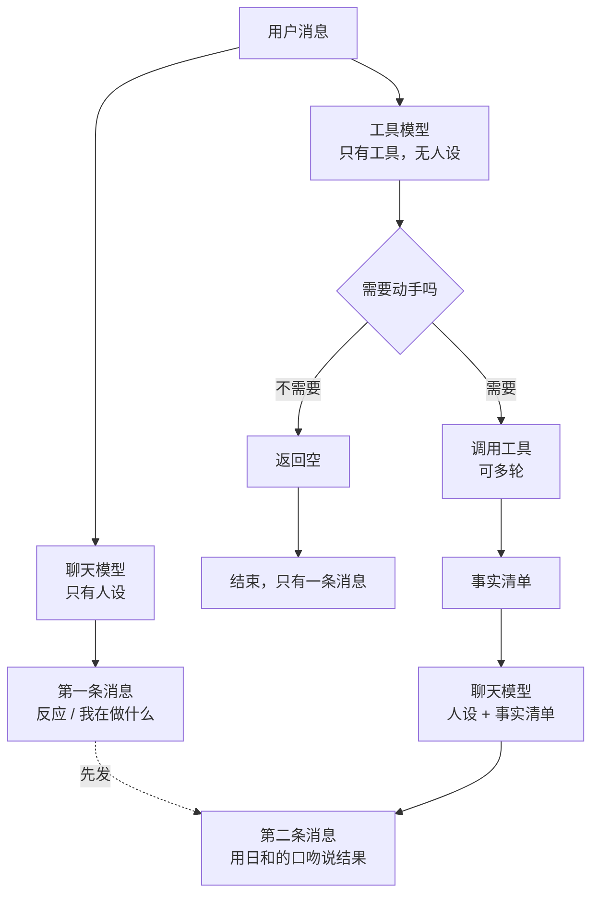

# 聊天与工具并行分层

- 状态：draft，等用户确认后才动代码
- 建立日期：2026-08-24
- 取代：`dispatch-poc` 的串行设计（见第 8 节，四个 Backlog issue 的处置）

## 1. 要解决什么

当前所有事情由一个模型在一次调用里完成：维持人设、判断要不要调工具、调工具、组织回复。
结果是人设被挤掉。实测数字：进入聊天 system prompt 的内容里，**真正描写日和是谁的只有
27 个字，占 1.5%**；工具 schema 3200 token、工具使用策略散文 3491 字、语气禁令约 200 字。

模型按体量分配注意力，所以输出是规则的样子，不是人的样子。

单纯删规则不行——那些规则大多是必要的，而且用户后续还要加功能。**出路是让规则和人设不在
同一个模型的上下文里**，各自可以独立生长。

## 2. 数据流

两个模型**同时**收到用户输入，不等对方。

有一个性质值得写下来：**工具模型返回空时只有一条消息，动了手才有两条。** 这跟人的行为一致
（"嗯"…"找到了"），不需要额外设计。

**顺序是硬的**：第一条消息永远先发，即使工具模型先跑完。否则会出现结果先到、反应后到。

## 3. 聊天模型

**上下文里只有人设**：`identity`、`user_model`、`communication`，加对话历史和已确认的记忆。
**没有工具 schema，没有工具使用策略，没有系统机制散文。**

### 3.1 唯一的硬约束：不要断言结果

第一次开口时，它还不知道后台做完了没有。所以：

> 你还不知道后台做完了没有。第一句只说你在做什么，或者接她的话。
> 等拿到结果再告诉她办成了什么。

**刻意写成正向表述而不是禁令。** 禁令告诉模型不许做什么却不给替代，留下一个真空，而模型填
真空的方式永远是选最安全的输出——干巴巴地陈述事实。当前 prompt 里堆了六条"不要 X"，那正是
现在语气出戏的直接原因，不要在新设计里重复。

会翻车的具体场景：用户说"帮我记一下明天三点开会"，聊天模型顺口答"好，记下了"，而工具模型
发现那个时段日历上已经有别的安排，或者调用失败了。**话已经说出去了。**

### 3.2 "这是纯聊天吧"这个判断是安全的，不要给它加规则

聊天模型可以自己判断"这看起来只是闲聊"，然后直接说句轻松的话，不摆出"我在处理"的姿态。

**这个判断错了不会丢工作**——工具模型是并行跑的，该记的照样记了。判断错的后果只是第一句
语气不对。

因此**不要给它写"怎么判断是不是聊天"的规则**。那些规则会重新挤占人设的位置，把我们绕回
原点。让它凭人设去感觉就行。

这跟老的串行设计有本质区别：那里同样的误判会直接导致该调的工具没调。

### 3.3 人设变重之后要防的三件事

聊天模型的人设会长期变厚（LT-168）。厚人设带来三种可测的退化，必须先有度量再去调，
否则只能凭感觉，而感觉在长 prompt 上非常不可靠：

| 退化 | 表现 | 能不能机械测 |
|---|---|---|
| **事实失真** | 「3 点的预约」被说成「下午那个约」 | **能**：数字、时间、人名、金额是否逐字出现 |
| **指令被淹没** | 「不要断言结果」被埋在大段人设里，第一句就说「记好了」 | **能**：检测完成类措辞是否出现在第一条消息 |
| **语气漂移** | 过度表演，或反过来变平 | 不能，只能人判断 |

前两项是硬指标，应当进离线 replay（第 7 节），并且**支持对比不同人设版本**——
这样人设迭代才有反馈回路，而不是改一版聊几句凭印象。

第三项没有捷径，但有了前两项兜底，至少可以确定「语气变好」不是以事实失真为代价换来的。

## 4. 工具模型

**上下文里没有人设、没有语气规则**，只有工具和判断所需的上下文（对话历史、今日 timeline、
待办 reminder、deadline）。它永远不直接对用户说话。

### 4.1 判断没有消失，只是换了位置

必须说清楚，否则会低估验证的必要性：**老设计里聊天模型判断"要不要升级"，新设计里工具模型
判断"要不要动手"。判错的后果一样——该记的没记。**

换位置的价值在于判断依据变了：

- 老设计的 SMALL_DECIDE 手里**没有工具列表**，靠一份从 45 条样本蒸馏的「触发清单」猜
  "这句话会不会需要工具"；
- 工具模型**看着 12 个工具的 schema** 判断"这里面有没有一个适用的"。

后者是具体得多的问题，但仍然是判断，仍然要验证（见第 7 节）。

### 4.1b 工具模型的 prompt 要可移植

**目标：这份 prompt 拿到任何一个带工具链的应用里都能直接用**，不含日和、不含用户的
个人要求、不含本项目特有的概念。这样它就不会被人设和用户偏好污染。

这带来一个必须处理的矛盾：**时区是工具模型的硬需求**（`set_reminder` 和
`log_timeline_event` 的日期运算全靠它），但时区是用户特有的信息。

解法与 curator 的「指令与数据分离」是同一条：**可移植的是指令，应用特有的是数据。**

| 层 | 内容 | 可移植 |
|---|---|---|
| 核心指令 | 职责（判断要不要动手）、三种输出、事实保真规则、失败降级阶梯、选工具的通用原则、永不直接对用户说话 | ✓ 完全 |
| 注入数据 | 工具 schema、当前时间与时区、应用上下文（今日记录、待办、可用项目名单） | ✗ 每个应用不同 |
| 应用附录 | 本应用特有的工具使用约束 | ✗ **有界的例外** |

核心指令里写「日期运算使用给定的时区」，时区的**值**作为数据注入。这样 prompt 本身
不含任何用户信息。

**应用附录是可移植性会漏的地方，必须有界。** 例如 LT-75 的「只能引用已建项目」就属于
这里——它是本应用的约束，不是通用规则。纪律有两条：附录只写**事实性的工具约束**，
不写语气、时机、分寸；附录长度要能一眼看完，超过一屏说明有东西放错了层。

顺带一个收益：**可移植的 prompt 天然就是可以独立测试的 prompt。** 用一组合成的工具
和合成的输入就能测它的判断，不需要跑 bot、不需要真实数据。这跟第 7 节的离线验证是同
一件事的两面。

### 4.2 输出契约

只有三种结果：

| 结果 | 含义 | 聊天模型收到什么 |
|---|---|---|
| 空 | 这轮不需要动手 | 没有第二条消息 |
| 事实清单 | 做了这些事 / 查到这些 | 逐条事实，用于组织第二条消息 |
| 做不到 | 没有适用的工具，或缺关键信息 | 说明原因，让聊天模型如实讲或追问 |

**事实清单的保真规则**：数字、时间、人名、金额**逐字保留**，聊天模型只能改语气不能改内容。
这是老设计就识别到的风险（"3 点的预约"被说成"下午的预约"），并行没有让它变轻——反而更重，
因为聊天模型的人设越强，润色冲动越大。

**"做不到"必须是显式结果，不能用空代替。** 两者对用户是完全不同的事：空是"没什么要做的"，
做不到是"有事要做但我做不了"。混在一起会让 bot 静默失败。

### 4.3 失败降级

每一层失败都要能退到更笨但更可靠的做法，**任何一层的失败方式都不能是"静默地什么都没做"**：

1. 工具调用报错 → 重试一次；
2. 仍然失败 → 作为"做不到"返回，说明是哪个工具失败；
3. 找不到合适的工具 → 返回"做不到"，让聊天模型如实告诉用户；
4. 超时或轮次超限（建议 5 轮 / 60 秒）→ 同上。

## 5. 工具简化

当前 15 个。按 LT-137 已定的决策，`save_memory` / `update_memory` / `delete_memory`
三个写工具下线（聊天模型永久没有直接写记忆的权限），剩 12 个。

**建议不要再合并了。** 剩下的 12 个是三个 CRUD 家族（timeline / reminder / deadline）
加 `query_calendar` 和 `search_history`。把每个家族合成一个带 `action` 参数的工具确实能把
数字压到 6，但代价是每个工具的 schema 变成条件式的——某些字段只在某些 action 下必填。
**模型最容易在条件必填上出错**，而这类错误 validator 很难拦。

真正的简化不在工具数量，在那 3491 字的使用策略散文。**它里面相当一部分是在教一个"既要维持
人设又要正确调工具"的模型怎么权衡**——专职工具模型不需要那些。这一段应该重写，只留工具之间
的选择规则（例如"同一件事延续用 update 而不是新建"），删掉所有跟语气、时机、分寸有关的内容。

### 5.1 工具搜索：暂不做

用户提出给工具模型加一个"搜索工具"的能力，先给极简列表，需要时再检索完整 schema。
**实测数据不支持现在做**：

- 15 个工具的完整 schema：6439 字符，约 3200 token；
- 极简索引（名字 + 一句话）：619 字符，约 300 token；
- 差额约 2900 token。

对一个**不带人设、prompt 高度静态**的工具模型来说，3200 token 不算负担，而且静态 prompt 的
cache 命中率很高。换来的代价是：多一次往返（在用户等回复的时候），以及用户自己指出的那个
失败模式——搜出来发现不是想要的用法。**这个失败模式在全量给工具时根本不存在。**

工具搜索是几十个工具以上才划算的东西。真做完第 5 节的简化，可能只剩八九个。

**如果将来工具数量真的涨上去**，兜底规则应当是：搜错了允许再搜一次，最多两次 → 两次都不对就
**回退到全量工具列表**（而不是放弃）→ 全量之后仍无合适工具，返回"做不到"。

## 5.2 section 怎么分配

### 判断规则

对每个 section 问一个问题：**它缺席时，哪个模型会出错？**

- 会**说错话** → 聊天模型
- 会**做错事**（选错工具、参数错、该去重没去重）→ 工具模型
- 两个都会错 → **拆开各拿一部分，不是两边都复制一份**

### 省 token 的关键：事实清单是一条天然的懒加载通道

工具模型本来就会把事实回传给聊天模型。所以：

> 凡是「聊天模型只在被触发时才需要知道」的东西，**不必常驻它的上下文**——
> 让工具模型在事实清单里带过去。
> 只有「聊天模型需要**主动提起**」的东西才必须常驻。

例如待办 reminder：聊天模型不需要天天看着那张列表，但当用户问起、或工具模型
刚设了一条时，事实清单会告诉它。而 deadline 不同——`protocols` 第一条规则要求
它在用户说"不想做"时**主动**查一眼日程，那就必须常驻。

### 分配表

| section / 占位符 | 聊天 | 工具 | 理由 |
|---|:--:|:--:|---|
| `identity`（人物部分） | ✓ | | 说错话 |
| `communication` | ✓ | | 81 字，纯语气 |
| `protocols` | ✓ | | 反应模式。注意它第一条依赖 `{deadlines}` |
| `user_model` | 拆 | 拆 | 见下 |
| `system_mechanics` | 拆 | 拆 | 见下 |
| `tools` 策略散文 | | ✓ | 且要重写变短 |
| 工具 schema | | ✓ | |
| `{memories}` | ✓ | | 见下 |
| `{relevant_history}` | ✓ | | 对话连续性，说话前就要有 |
| `{weather}` | ✓ | | 聊天内容 |
| `{calendar}` | ✓ | | 今日日程；查未来是 `query_calendar` 工具的事 |
| `{today_timeline}` | | ✓ | 「同一件事延续就 update 而不是新建」是工具决策 |
| `{pending_reminders}` | | ✓ | 防止重复 `set_reminder` |
| `{projects}` | | ✓ | LT-75：只能引用已建项目 |
| `{deadlines}` | ✓ | ✓ | **唯一真正两边都要的**，见下 |

### 三个需要拆的

**`user_model` 按功能拆，不按段落拆。** 影响工具参数的事实归工具模型——**时区是硬需求**，
`set_reminder` 和 `log_timeline_event` 的日期运算全依赖它；作息（几点睡几点起）影响
"明早"指的是几点。口味、性格、爱好归聊天模型。老的 `build_big_worker_parts` 注释里写的
"trimmed USER_MODEL (facts only)" 就是这个意思。

**`system_mechanics` 按条拆**：换行分条发送、`[SILENT]` → 聊天模型（只有它产出用户可见文本）；
多轮 tool calling 与 think 标签 → 工具模型；时间戳格式、识别历史里的系统输出 → 两边都要
（都在读同一份对话历史）。

**`{deadlines}` 两边都常驻**，这是唯一的例外。聊天模型需要它是因为 `protocols` 要求
主动查（"必须先看一眼【待完成的 Deadline】"）和 morning check-in 要"盘一盘今天的重点"；
工具模型需要它是为了 `add_deadline` 去重。

### `{memories}` 归聊天模型

用户明确问过这条。答案是聊天模型，而且理由很干净：**记忆解决的是"跨对话知道在跟谁说话"，
这是说话的问题。** 而 LT-137 下线三个记忆写工具之后，没有任何工具需要记忆做参数。

由此得到一个对称：**常驻记忆 → 聊天模型；记忆检索（`search_memory`）→ 工具模型。**
聊天模型带着已确认的事实说话，需要翻找时由工具模型去查。

### 这个架构不省 token，它省的是注意力

必须说清楚，否则会对成本有错误预期。

拆完之后每个模型的 prompt 都比现在的合并版小，但**两次调用加起来的总 token 大致持平甚至
略增**（`{deadlines}` 两边都发，且纯聊天也要付工具模型那一次）。

真正的 token 收益来自另外两处，它们与拆分独立：

1. **重写 `tools` 策略散文。** 现在 3491 字里相当一部分是在教一个"既要维持人设又要正确调
   工具"的模型怎么权衡分寸。专职工具模型不需要那些，估计能压到三分之一。
2. **cache 命中率。** 拆分之后每个 prompt 的成分更均匀——工具模型的几乎全静态，聊天模型
   的动态部分集中在末尾。当前合并版把静态和动态交错在一起，对 cache 不友好。
   注意 LT-156 已实测出 check_in 路径 cached_tokens 恒为 0，所以 cache 现在处于
   "不知道能不能用"的状态，**这一项收益在 LT-156 查明之前不能计入**。

## 5.3 场景状态

### 要解决的 bug

check-in 的模板（采访那份 2985 字）是作为**最后一条 user 消息**追加的
（`ai_engine_base.scheduled_action`），不是 system 的一部分。所以：

- **它开口那一轮**：模板离生成位置最近，语气对；
- **用户一回复**：用户的消息成了新的最后一条，模板被推远，system 里那 3491 字
  工具策略重新变成最强信号，**语气掉回去**。

这解释了一个之前没解释清楚的现象：睡前消息一直是暖的（每次触发都重新注入），
而采访的后续回复是硬的（模板只在开口那次存在）。

顺带更正一个容易搞错的前提：**普通聊天路径是有工具的**。`chat()` 调
`call_with_tools_fn` 且不传 `tool_names`，拿的是全部 15 个。用户回复之后消失的
只有 check-in 模板，不是工具。

### 为什么不是"每轮重注模板"

最直接的修法是模板在有效期内每轮都注入。但 2985 字 × 五个来回是一万五千字，
而且它会把一个更根本的问题固化下来：**模板里混着语气指引**（"像一个话不多但记性
好的朋友。平实，不亢奋，不夸奖"），而语气应当由人设决定，不该由每个 check-in
模板各写一份。

拆开模板（语气段 / 问卷段）能省 token，但**破坏可移植性**：别人拿这份模板去用，
得先按这个划分重写一遍。

### 方案：让工具模型压缩出一句场景描述

给工具模型加一个工具，把当前 check-in 的意图压成一句几十字的场景描述，写进会话状态。
后续每轮注入这一句，而不是整份模板。

**模板保持原样**——作者怎么写都行，压缩这一步不要求它区分语气和问卷。可移植性问题消失。

**场景描述里不能带语气。** 只描述"在做什么"：

> 场景：今天的晚间采访，刚问了晚饭吃什么，她说了麻辣烫。

不是：

> 场景：晚间采访，语气要平实、不亢奋、不夸奖……

**这个约束有一个直接后果，必须写明：语气全部落到人设身上，而人设现在承担不了**
（27 字对 200 字禁令）。所以 **LT-168 是本节的前置，不是并列项**。场景描述拿掉语气
之后，如果人设那边没接住，第二轮开始的语气会比现在更飘——连模板里那点语气指引都没了。

### 两条硬规则

**一、生成一次，永不重新生成。** 每次 check-in 触发生成一条，场景期内不再更新。
模型输出反复喂回自己的 prompt 会累积漂移：第三轮的描述是对第二轮描述的转述，
两三轮之后跟原意无关。宁可稍微过时，不要漂。

**二、注入时明确标记为系统生成。** 这跟记忆系统那条"模型输出不是用户事实"是同一条
纪律。虽然这里风险低（只是个场景标签），但混进对话历史当成用户原话就麻烦了。

### 终止条件：不需要判断"场景结束了"

这是本节最容易想复杂的地方。**不需要检测对话何时结束**（那不可靠），只需要一个有效期：

| 条件 | 谁判 | 可靠性 |
|---|---|---|
| 下一个 check-in 触发 | 代码 | 完全可靠 |
| 超过 N 分钟没有新消息 | 代码 | 完全可靠 |
| 超过 N 个来回 | 代码 | 完全可靠 |
| 用户明显换话题了 | 模型 | 不可靠，**不做** |

**现有 check-in 互相就是彼此的终止条件**：采访 15:59 触发，下一个是 21:23，中间夹着
几次「随手说一句」。新的覆盖旧的，不需要谁判断。

第四条不必做。用户聊着聊着换话题，前三条至少有一条会先到；而且**场景还挂着也无害**——
采访模板本来就写着"她岔开去聊别的：跟着她走"。场景标记带的是场景，不是任务清单，
它不会把人拽回去。

来回数上限直接用模板已有的口径（"一到三个来回就结束，最多不要超过五个"）——那句话现在
只在开口那一瞬间存在，做成会话状态就是让代码来记这个数。

**这是参数问题，不是判断问题。** 定错了改一个数字，不用重新设计。

### 工具本身要无机

这个工具**不针对某一次 check-in、也不针对本项目**：输入一段意图描述，输出一句场景摘要
并写入状态。它自己成一个体系，符合第 4.1b 节的可移植要求——核心指令可移植，
"当前挂着哪个场景"是注入数据。

### check-in 增加"是否调用工具模型"开关

`check_ins` 表加一列。不是所有 check-in 都需要——睡前提醒说完就结束，不需要场景状态；
采访需要。默认关闭，按需打开。

### 生成时机：两个选项

| | 触发时生成 | 用户首次回复时生成 |
|---|---|---|
| 描述质量 | 只能描述意图（"要做晚间采访"） | 有真实轨迹（问了什么、答了什么），准得多 |
| 成本 | 每次 check-in 都付，**包括用户没回复的** | 只在真的聊起来时才付 |
| 延迟 | 不影响用户 | 给首次回复加一点 |
| 现有机制 | 已有工具调用位置，改动小 | 需要在 chat 路径新增判断 |

用户倾向触发时生成（现有机制支持，改动小）。代价是给不会发生的对话付钱——而 bot 主动
开口后用户不回复的比例应该不低。

**折中办法**：触发时生成，但只在该 check-in 的开关打开时生成。这样"不需要场景"的
check-in（睡前、morning）零成本，"需要场景"的才付。这一条已经由上面那个开关覆盖了。

## 6. 对 LT-137 的影响

LT-137 原本把 `search_memory` 设计成**聊天模型的工具**。在并行架构里它属于**工具模型**——
聊天模型不该自己决定去检索，它只负责接收事实。

这不是推翻 LT-137，是换挂载点。需要同步修改的是它的验收条件（"chat 与 check-in 的 tool
profile 都带 search_memory" 不再适用）。

按注入权限分档注入记忆（已实现、开关未开）不受影响：那是聊天模型的上下文，与工具无关。

## 7. 怎么验证

老设计的三条通过条件里，**"SMALL_DECIDE 路由准确率 > 85%" 作废**（那个判断不存在了），
另外两条仍然有效，并新增一条：

| 指标 | 通过条件 | 为什么 |
|---|---|---|
| 工具模型漏判率 | 应动手却返回空 < 10% | 取代路由准确率，是新架构最关键的风险 |
| 工具模型误判率 | 不该动手却动手 < 10% | 误记比漏记更难发现 |
| 事实保真 | 数字/时间/人名漂移 = 0 | 聊天模型润色冲动更强，标准应比老设计的 5% 更严 |
| 消息顺序 | 第一条永远先于第二条 | 并行特有的新风险 |

验证方式沿用老设计的思路：离线 replay，不需要跑 bot。样本可以直接用 LT-10 已经标注好的
那批（步骤 0 已 Done，在 commit `1295475` 的 `docs/dispatch-escalation-samples.md`），
标签语义从"该不该升级"重解释为"该不该动手"，基本可以复用：`[Y]` 和 `[L]` 都是该动手，
`[N]` 是不该动手。

**但那批样本类别偏斜**：约 37 条 `[Y]`、12 条 `[L]`、只有 8 条 `[N]`。它当初是按
"提取 escalation 候选"收集的，正例天然过采样。因此：

- **漏判率可以直接测**（正例充足）；
- **误判率测不准**，8 条负例的置信区间太宽。开工前需要补一批纯闲聊样本——
  从 `conversation_messages` 里挑不涉及任何工具的普通对话即可，不需要重新人工标注
  多少条，因为"这轮不该动手"对纯闲聊是显然的。

事实保真和指令遵守（第 3.3 节）同样进这套 replay，并且要能对比不同人设版本。

## 8. dispatch-poc 四个 Backlog issue 的处置

| issue | 处置 |
|---|---|
| LT-10 步骤 0：离线标注 escalation 样本 | 已 Done，**样本可复用**，标签语义重解释 |
| LT-11 步骤 1：4 份 prompt 草稿 | 已 Done。`SMALL_DECIDE` 作废（不再需要路由）；`BIG_WORKER` 的"人格留空 + 三段输出"思路**继续有效**，是第 4 节的原型；`SMALL_PARAPHRASE` 继续有效 |
| LT-12 步骤 2：dispatch engine | **重写**。串行数据流、`escalate_state` 持久化、pre-filter 全部不适用 |
| LT-13 步骤 3：离线 replay 验证 | **改通过条件**，见第 7 节 |
| LT-14 步骤 4：第二 bot 进程 | 仍然适用（测试基础设施） |
| LT-15 步骤 5：路由 + 配置 | "路由"部分作废，配置部分保留 |

`bot/prompts_dispatch.py` 目前是死代码（全仓库无人 import）。它的 parser 和
`build_big_worker_parts` 可以复用，`build_small_decide_prompt` 应当删除。

## 9. 未决问题

1. **`escalate_state` 这个概念还要不要。** 老设计用它表示"当前处在一段需要工具的多轮任务里"。
   并行架构下工具模型每轮都跑，似乎不需要显式状态。但多轮收集信息的场景（"记一下开会"→"几点"
   →"三点"）里，工具模型需要知道前两轮的意图还没完成。可能靠对话历史就够，需要验证。
2. **聊天模型拿到事实之后是第二条消息，还是编辑第一条。** Discord 支持编辑。编辑更接近
   "一个人在说话"，两条更接近"我在做，做完了"。这是体验判断，建议先做两条，因为实现简单
   且可观察。
3. **成本。** 每轮至少两次调用，纯聊天也是。老的串行设计纯聊天只要一次。工具模型可以用小
   模型且 prompt 静态，增量应该不大，但这是并行的固有代价，优化不掉。需要实测。
4. **check-in 路径怎么走。** 主动消息没有用户输入可以分发。最简单的做法是 check-in 只走聊天
   模型，不走工具模型——但 check-in 里也会记 timeline。需要单独设计。

## 10. 与人设修复的关系

**这份设计不解决语气出戏。**

`build_small_decide_prompt` 和 `build_small_paraphrase_prompt` 都引用 `identity` 和
`communication`，而那 200 字语气禁令就在里面，会原样跟着人设进入聊天模型。并行拿掉的是
3200 token 的工具噪音，**27 字人设对 200 字禁令这个比例一个字都没变**。

因此顺序建议是：**先修人设（把岗位描述和协议规则搬出 `identity`，把禁令改写成正向表述），
再做这个架构。** 理由有二：修人设今天就能做完，而这是个真正的项目；而且拆完之后
`identity` 会被两个 prompt 同时引用，现在改好将来两边直接受益。
