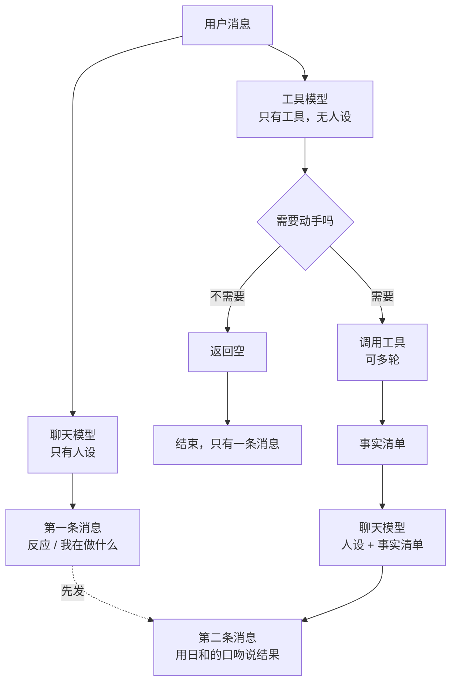

# 聊天与工具并行分层

- 状态：draft，等用户确认后才动代码
- 建立日期：2026-08-24
- 取代：`dispatch-poc` 的串行设计（见第 8 节，四个 Backlog issue 的处置）

## 1. 要解决什么

当前所有事情由一个模型在一次调用里完成：维持人设、判断要不要调工具、调工具、组织回复。
结果是人设被挤掉。实测数字：进入聊天 system prompt 的内容里，**真正描写日和是谁的只有
27 个字，占 1.5%**；工具 schema 3200 token、工具使用策略散文 3491 字、语气禁令约 200 字。

模型按体量分配注意力，所以输出是规则的样子，不是人的样子。

单纯删规则不行——那些规则大多是必要的，而且用户后续还要加功能。**出路是让规则和人设不在
同一个模型的上下文里**，各自可以独立生长。

## 2. 数据流

两个模型**同时**收到用户输入，不等对方。

有一个性质值得写下来：**工具模型返回空时只有一条消息，动了手才有两条。** 这跟人的行为一致
（"嗯"…"找到了"），不需要额外设计。

**顺序是硬的**：第一条消息永远先发，即使工具模型先跑完。否则会出现结果先到、反应后到。

## 3. 聊天模型

**上下文里只有人设**：`identity`、`user_model`、`communication`，加对话历史和已确认的记忆。
**没有工具 schema，没有工具使用策略，没有系统机制散文。**

### 3.1 唯一的硬约束：不要断言结果

第一次开口时，它还不知道后台做完了没有。所以：

> 你还不知道后台做完了没有。第一句只说你在做什么，或者接她的话。
> 等拿到结果再告诉她办成了什么。

**刻意写成正向表述而不是禁令。** 禁令告诉模型不许做什么却不给替代，留下一个真空，而模型填
真空的方式永远是选最安全的输出——干巴巴地陈述事实。当前 prompt 里堆了六条"不要 X"，那正是
现在语气出戏的直接原因，不要在新设计里重复。

会翻车的具体场景：用户说"帮我记一下明天三点开会"，聊天模型顺口答"好，记下了"，而工具模型
发现那个时段日历上已经有别的安排，或者调用失败了。**话已经说出去了。**

### 3.2 "这是纯聊天吧"这个判断是安全的，不要给它加规则

聊天模型可以自己判断"这看起来只是闲聊"，然后直接说句轻松的话，不摆出"我在处理"的姿态。

**这个判断错了不会丢工作**——工具模型是并行跑的，该记的照样记了。判断错的后果只是第一句
语气不对。

因此**不要给它写"怎么判断是不是聊天"的规则**。那些规则会重新挤占人设的位置，把我们绕回
原点。让它凭人设去感觉就行。

这跟老的串行设计有本质区别：那里同样的误判会直接导致该调的工具没调。

## 4. 工具模型

**上下文里没有人设、没有语气规则**，只有工具和判断所需的上下文（对话历史、今日 timeline、
待办 reminder、deadline）。它永远不直接对用户说话。

### 4.1 判断没有消失，只是换了位置

必须说清楚，否则会低估验证的必要性：**老设计里聊天模型判断"要不要升级"，新设计里工具模型
判断"要不要动手"。判错的后果一样——该记的没记。**

换位置的价值在于判断依据变了：

- 老设计的 SMALL_DECIDE 手里**没有工具列表**，靠一份从 45 条样本蒸馏的「触发清单」猜
  "这句话会不会需要工具"；
- 工具模型**看着 12 个工具的 schema** 判断"这里面有没有一个适用的"。

后者是具体得多的问题，但仍然是判断，仍然要验证（见第 7 节）。

### 4.2 输出契约

只有三种结果：

| 结果 | 含义 | 聊天模型收到什么 |
|---|---|---|
| 空 | 这轮不需要动手 | 没有第二条消息 |
| 事实清单 | 做了这些事 / 查到这些 | 逐条事实，用于组织第二条消息 |
| 做不到 | 没有适用的工具，或缺关键信息 | 说明原因，让聊天模型如实讲或追问 |

**事实清单的保真规则**：数字、时间、人名、金额**逐字保留**，聊天模型只能改语气不能改内容。
这是老设计就识别到的风险（"3 点的预约"被说成"下午的预约"），并行没有让它变轻——反而更重，
因为聊天模型的人设越强，润色冲动越大。

**"做不到"必须是显式结果，不能用空代替。** 两者对用户是完全不同的事：空是"没什么要做的"，
做不到是"有事要做但我做不了"。混在一起会让 bot 静默失败。

### 4.3 失败降级

每一层失败都要能退到更笨但更可靠的做法，**任何一层的失败方式都不能是"静默地什么都没做"**：

1. 工具调用报错 → 重试一次；
2. 仍然失败 → 作为"做不到"返回，说明是哪个工具失败；
3. 找不到合适的工具 → 返回"做不到"，让聊天模型如实告诉用户；
4. 超时或轮次超限（建议 5 轮 / 60 秒）→ 同上。

## 5. 工具简化

当前 15 个。按 LT-137 已定的决策，`save_memory` / `update_memory` / `delete_memory`
三个写工具下线（聊天模型永久没有直接写记忆的权限），剩 12 个。

**建议不要再合并了。** 剩下的 12 个是三个 CRUD 家族（timeline / reminder / deadline）
加 `query_calendar` 和 `search_history`。把每个家族合成一个带 `action` 参数的工具确实能把
数字压到 6，但代价是每个工具的 schema 变成条件式的——某些字段只在某些 action 下必填。
**模型最容易在条件必填上出错**，而这类错误 validator 很难拦。

真正的简化不在工具数量，在那 3491 字的使用策略散文。**它里面相当一部分是在教一个"既要维持
人设又要正确调工具"的模型怎么权衡**——专职工具模型不需要那些。这一段应该重写，只留工具之间
的选择规则（例如"同一件事延续用 update 而不是新建"），删掉所有跟语气、时机、分寸有关的内容。

### 5.1 工具搜索：暂不做

用户提出给工具模型加一个"搜索工具"的能力，先给极简列表，需要时再检索完整 schema。
**实测数据不支持现在做**：

- 15 个工具的完整 schema：6439 字符，约 3200 token；
- 极简索引（名字 + 一句话）：619 字符，约 300 token；
- 差额约 2900 token。

对一个**不带人设、prompt 高度静态**的工具模型来说，3200 token 不算负担，而且静态 prompt 的
cache 命中率很高。换来的代价是：多一次往返（在用户等回复的时候），以及用户自己指出的那个
失败模式——搜出来发现不是想要的用法。**这个失败模式在全量给工具时根本不存在。**

工具搜索是几十个工具以上才划算的东西。真做完第 5 节的简化，可能只剩八九个。

**如果将来工具数量真的涨上去**，兜底规则应当是：搜错了允许再搜一次，最多两次 → 两次都不对就
**回退到全量工具列表**（而不是放弃）→ 全量之后仍无合适工具，返回"做不到"。

## 6. 对 LT-137 的影响

LT-137 原本把 `search_memory` 设计成**聊天模型的工具**。在并行架构里它属于**工具模型**——
聊天模型不该自己决定去检索，它只负责接收事实。

这不是推翻 LT-137，是换挂载点。需要同步修改的是它的验收条件（"chat 与 check-in 的 tool
profile 都带 search_memory" 不再适用）。

按注入权限分档注入记忆（已实现、开关未开）不受影响：那是聊天模型的上下文，与工具无关。

## 7. 怎么验证

老设计的三条通过条件里，**"SMALL_DECIDE 路由准确率 > 85%" 作废**（那个判断不存在了），
另外两条仍然有效，并新增一条：

| 指标 | 通过条件 | 为什么 |
|---|---|---|
| 工具模型漏判率 | 应动手却返回空 < 10% | 取代路由准确率，是新架构最关键的风险 |
| 工具模型误判率 | 不该动手却动手 < 10% | 误记比漏记更难发现 |
| 事实保真 | 数字/时间/人名漂移 = 0 | 聊天模型润色冲动更强，标准应比老设计的 5% 更严 |
| 消息顺序 | 第一条永远先于第二条 | 并行特有的新风险 |

验证方式沿用老设计的思路：离线 replay，不需要跑 bot。样本可以直接用 LT-10 已经标注好的
那批（步骤 0 已 Done），标签语义从"该不该升级"重解释为"该不该动手"，基本可以复用。

## 8. dispatch-poc 四个 Backlog issue 的处置

| issue | 处置 |
|---|---|
| LT-10 步骤 0：离线标注 escalation 样本 | 已 Done，**样本可复用**，标签语义重解释 |
| LT-11 步骤 1：4 份 prompt 草稿 | 已 Done。`SMALL_DECIDE` 作废（不再需要路由）；`BIG_WORKER` 的"人格留空 + 三段输出"思路**继续有效**，是第 4 节的原型；`SMALL_PARAPHRASE` 继续有效 |
| LT-12 步骤 2：dispatch engine | **重写**。串行数据流、`escalate_state` 持久化、pre-filter 全部不适用 |
| LT-13 步骤 3：离线 replay 验证 | **改通过条件**，见第 7 节 |
| LT-14 步骤 4：第二 bot 进程 | 仍然适用（测试基础设施） |
| LT-15 步骤 5：路由 + 配置 | "路由"部分作废，配置部分保留 |

`bot/prompts_dispatch.py` 目前是死代码（全仓库无人 import）。它的 parser 和
`build_big_worker_parts` 可以复用，`build_small_decide_prompt` 应当删除。

## 9. 未决问题

1. **`escalate_state` 这个概念还要不要。** 老设计用它表示"当前处在一段需要工具的多轮任务里"。
   并行架构下工具模型每轮都跑，似乎不需要显式状态。但多轮收集信息的场景（"记一下开会"→"几点"
   →"三点"）里，工具模型需要知道前两轮的意图还没完成。可能靠对话历史就够，需要验证。
2. **聊天模型拿到事实之后是第二条消息，还是编辑第一条。** Discord 支持编辑。编辑更接近
   "一个人在说话"，两条更接近"我在做，做完了"。这是体验判断，建议先做两条，因为实现简单
   且可观察。
3. **成本。** 每轮至少两次调用，纯聊天也是。老的串行设计纯聊天只要一次。工具模型可以用小
   模型且 prompt 静态，增量应该不大，但这是并行的固有代价，优化不掉。需要实测。
4. **check-in 路径怎么走。** 主动消息没有用户输入可以分发。最简单的做法是 check-in 只走聊天
   模型，不走工具模型——但 check-in 里也会记 timeline。需要单独设计。

## 10. 与人设修复的关系

**这份设计不解决语气出戏。**

`build_small_decide_prompt` 和 `build_small_paraphrase_prompt` 都引用 `identity` 和
`communication`，而那 200 字语气禁令就在里面，会原样跟着人设进入聊天模型。并行拿掉的是
3200 token 的工具噪音，**27 字人设对 200 字禁令这个比例一个字都没变**。

因此顺序建议是：**先修人设（把岗位描述和协议规则搬出 `identity`，把禁令改写成正向表述），
再做这个架构。** 理由有二：修人设今天就能做完，而这是个真正的项目；而且拆完之后
`identity` 会被两个 prompt 同时引用，现在改好将来两边直接受益。
