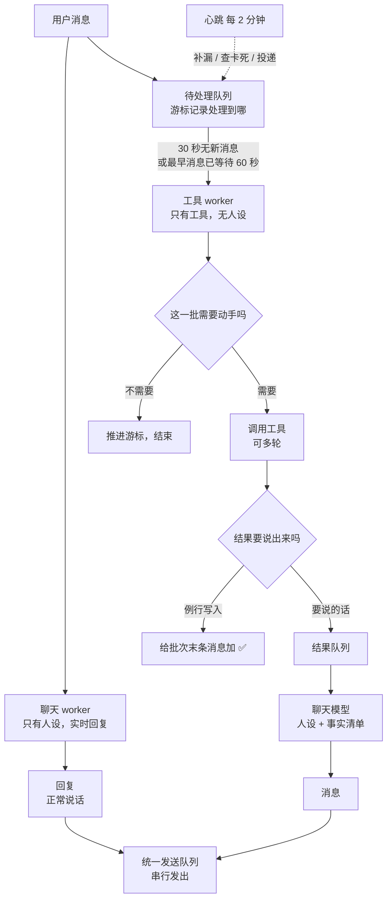

# 聊天与工具并行分层

- 状态：已定案（2026-08-26）；LT-169 实现规格已合并，LT-170 的共享 `GenerationGate` 与持久 outbound queue、LT-171 的场景边界修正均已于 2026-08-27 合并进 main；开关默认关闭，生产尚未启用。第 9 节原来的四个未决问题已于 2026-08-24 全部定案，第 9.5 节异步带来的六个问题已于 2026-08-26 定案。第 5.3 节场景状态已经写成代码（见 `bot/memory/scene_state.py` 与 `track_scene` 工具）
- **2026-08-25 重大修订**：同步两拍改为**异步心跳与排队模型**，见第 0 节。凡正文旧结论与第 0 节冲突，一律按第 0 节算。受影响的章节已就地改写，改写点在第 0 节末尾列出。
- **2026-08-26 review 定案**：静默窗口先采用 30 秒，批次最长等待 60 秒；结果表达读取最近 20 条对话；成功设置提醒时发送确认消息；记忆检索归属留待 spike；并补充分批状态、测试层次与人设修改。
- 建立日期：2026-08-24
- 取代：`dispatch-poc` 的串行设计（见第 8 节，旧 issue 的最终处置）
## 0. 用户决策记录：异步心跳与排队模型（2026-08-25）

本节只记录用户明确作出的产品决定。工程手段（游标、幂等键、发送队列、批次占用时限）不属于这里，写在对应的实现章节。**本节与正文任何旧结论冲突时，按本节算。**

1. **聊天模型默认实时、连续地处理对话，不等待工具。** 用户发一条，她答一条。唯一例外是纯事实查询：如果当前上下文无法直接回答，聊天模型可以返回 `[SILENT]`，由查询结果充当这一轮唯一的用户可见回复。
2. **工具侧按批次跑，正常触发条件是新消息之后 30 秒没有新消息。** 用户连续说话时计时器重置；为了避免热络对话使计时器永远不到期，批次从最早一条未处理消息开始计算，满 60 秒也必须触发。两个参数均为初始值，可以根据实测调整。
3. **每两分钟一次心跳，只做三件事：补处理漏掉的消息、检查卡死的批次、投递已完成的结果。** 心跳不是正常的执行延迟——正常路径是第 2 条那个静默触发。
4. **工具结果进入队列，等当前这条聊天回复发完之后，再由聊天模型按人设表达。**
5. **放弃"每次工具操作严格产生两条消息"这条硬约束。** 见第 2.1 节：普通例行写入用一个表情反应交付，提醒确认和其他需要说出来的话进入结果队列。配套参数（都是参数，不是设计，定错了改数字）：静默 30 秒；批次最长等待 60 秒；心跳周期 2 分钟；工具结果默认主动发送，不等用户下一次开口。
### 这次修订动了哪些章节


| 章节      | 变化                                        |
| ------- | ----------------------------------------- |
| 第 2 节   | 数据流改写为四个部件；新增 2.1 交付通道、2.2 统一发送队列         |
| 第 3.1 节 | "两拍结构"改写为"不许预告还没发生的事"；两拍的时间假设作废           |
| 第 3.2 节 | 结论不变，论据变强                                 |
| 第 4.3 节 | 失败降级要和心跳配合，新增批次状态与占用时限                    |
| 第 4.4 节 | 新增：批次的输入契约（游标、只有用户消息能触发、改口、幂等）            |
| 第 5 节   | 工具数量 15 改为 16，并记录 `set_scene` 泄漏到普通聊天这个缺陷 |
| 第 5.1 节 | 结论不变，但"多一次往返在用户等回复的时候"这条论据作废              |
| 第 5.2 节 | 懒加载通道的延迟变了；成本改为按批次核算                      |
| 第 5.3 节 | 场景生成必须绑在 check-in 触发那一刻，不能走静默通道           |
| 第 7 节   | 度量单位从单条消息改为批次；新增并发用例并拆分离线、单元、集成验证层次       |
| 第 9.2 节 | 作废                                        |
| 第 9.5 节 | 异步带来的六个问题已经写入 review 决定                     |
| 第 12 节  | 新增第 0 步：队列、游标、幂等、心跳这层基础设施                 |
| 第 13 节  | 新增：当前分支上两个既存缺陷                            |

## 1. 要解决什么

当前所有事情由一个模型在一次调用里完成：维持人设、判断要不要调工具、调工具、组织回复。结果是人设被挤掉。实测数字：进入聊天 system prompt 的内容里，**真正描写日和是谁的只有27 个字，占 1.5%**；工具 schema 3200 token、工具使用策略散文 3491 字、语气禁令约 200 字。模型按体量分配注意力，所以输出是规则的样子，不是人的样子。单纯删规则不行——那些规则大多是必要的，而且用户后续还要加功能。**出路是让规则和人设不在同一个模型的上下文里**，各自可以独立生长。

## 2. 数据流


**这一节按第 0 节的异步决定重写。** 四个部件，各自的节奏不同：





两条通道**互不等待**：聊天按消息走，工具按批次走。一个批次可能覆盖用户连续说的三条消息，也可能在她已经聊到别的话题之后才出结果。**旧设计那个"返回空只有一条消息、动了手才有两条"的性质没有了。** 批次和消息不再一一对应，所以交付方式必须另外定，见 2.1。
### 2.1 交付通道：表情反应，还是消息
放弃"两条消息"之后，代码里其实已经有一个更合适的通道：`bot/discord_bot.py:191-198` 在工具调用命中 `SET_TOOL_NAMES`（`bot/tools.py:376-383`，只含新建和更新类写工具）时，给用户那条触发消息加一个 ✅ 表情反应，而不是发消息。

按这条分两种交付：

| 结果类型                            | 怎么交付                     |
| ------------------------------- | ------------------------ |
| timeline、deadline 等普通例行写入 | 只在**这一批覆盖的最后一条用户消息**上加 ✅ |
| 成功设置或更新 reminder | 走结果队列，由聊天模型发送确认消息 |
| 用户问的事实、执行失败、结果和用户预期不一致、改口后的纠正 | 走结果队列，由聊天模型用她自己的口吻说出来 |
这样分有两个好处：动手的痕迹从"多一条消息"变成"一个反应"，用户看得见，但对话里不会多出一句迟到的"记好了"；而且一个批次里三条 timeline 写入不会变成三句汇报。成功设置或更新 reminder 的边界已经明确为发送确认消息，见第 9.5 节第六条。
### 2.2 统一发送队列

> **LT-170 实现状态（2026-08-26）**：本节的 SQLite outbox、单 consumer、同频道队首阻塞、lease fencing、失败重试、共享生成 gate、关闭前排空校验和默认关闭的分阶段开关均已实现；自动测试覆盖重启恢复、终态失败放行、跨频道等待、过期 lease、真实 Bot/Scheduler gate 接线与 2000 字分片不交错。代码已于 2026-08-27 合并进 main，开关默认关闭，生产尚未启用。

旧设计靠"第一条永远先于第二条"保证顺序。异步之后这条不够用了，**换成一条更强的保证：
所有用户可见的输出（聊天回复、工具结果、check-in、提醒）经过同一个发送队列，串行发出。**

这不只是为异步服务；它和下面的共享 `GenerationGate` 一起修掉一个现在就存在的缺陷——`_ai_lock` 不覆盖用户消息路径，详见第 13 节第二条。只有 outbox 而没有共享 gate，只能保证已经入队的内容不交错，不能阻止主动消息在聊天回复仍在生成时抢先入队。

#### 2.2.1 发送串行与生成串行是两层，不互相取代

**明确结论：发送队列不取代 `_ai_lock` 的职责，两者并存。** 但代码里不再保留一个只属于 `Scheduler` 的私有锁：把它提升为进程级 `GenerationGate`，在 `main.py` 创建一次，同时注入 `LifeTrackerBot`、`Scheduler` 和工具结果表达器。

两者保护的边界不同：

| 组件 | 串行化什么 | 不负责什么 |
| --- | --- | --- |
| `GenerationGate` | 聊天首次回复、工具结果表达、check-in、reminder 的**上下文快照与文本生成** | 不发送 Discord 消息；不包住工具 worker 本身，否则又会把两条通道串回去 |
| `OutboundQueue` | 已经生成好的消息或 reaction 的**投递**，一个 delivery 的所有 2000 字切片发完后才取下一项 | 不阻止两个模型同时基于不同时间点的上下文生成内容 |

当前 `Scheduler._ai_lock` 因此是**移动并扩展作用域**，不是删除。用户消息先写入 `conversation_messages`，随后在共享 gate 内读取 context window 并调用聊天模型；check-in 和 reminder 也必须在同一 gate 内读取窗口并生成。这样聊天回复正在生成时，主动消息不会基于中途状态生成后插到它前面。已经开始生成的主动消息不做强行取消；锁保证的是不会有两个生成过程重叠。

gate 可以先用一把共享 `asyncio.Lock` 实现。持锁期间允许等待自己的 delivery 发完，因为发送 consumer **永远不获取 gate**；否则会形成 `生成 → 等发送 → 等生成锁` 的死锁。工具 worker 的执行、批次 lease 和心跳不经过这把锁，只有它产出事实清单后、需要调用聊天模型表达结果时才进入 gate。

#### 2.2.2 持久发送 outbox

发送队列用 SQLite outbox，而不是只放一个进程内 `asyncio.Queue`。进程内队列只能保证活着时不交错，重启会丢掉刚完成的工具结果；SQLite 行负责事实，`asyncio.Event` 只负责把 consumer 叫醒。

迁移按下面的表和索引落地：

```sql
CREATE TABLE outbound_deliveries (
    id INTEGER PRIMARY KEY AUTOINCREMENT,
    channel_id TEXT NOT NULL,
    kind TEXT NOT NULL CHECK(kind IN ('message', 'reaction')),
    content TEXT,
    reaction TEXT,
    target_discord_message_id TEXT,
    source_type TEXT NOT NULL,
    source_id TEXT NOT NULL,
    dedupe_key TEXT NOT NULL UNIQUE,
    status TEXT NOT NULL DEFAULT 'pending'
        CHECK(status IN ('pending', 'sending', 'retry_wait', 'sent', 'failed')),
    attempt_count INTEGER NOT NULL DEFAULT 0 CHECK(attempt_count >= 0),
    available_at TEXT NOT NULL DEFAULT (datetime('now')),
    locked_at TEXT,
    lease_token TEXT,
    discord_message_ids_json TEXT,
    last_error TEXT,
    created_at TEXT NOT NULL DEFAULT (datetime('now')),
    updated_at TEXT NOT NULL DEFAULT (datetime('now')),
    sent_at TEXT,
    CHECK(
        (kind = 'message' AND content IS NOT NULL AND reaction IS NULL
         AND target_discord_message_id IS NULL)
        OR
        (kind = 'reaction' AND content IS NULL AND reaction IS NOT NULL
         AND target_discord_message_id IS NOT NULL)
    )
);

CREATE INDEX idx_outbound_deliveries_channel_order
    ON outbound_deliveries(channel_id, status, id);
```

`id` 就是同一 channel 的投递顺序。consumer 每次只领取该 channel **最小的非终态 id**；如果队首处于尚未到期的 `retry_wait`，后面的项目也等待，不能越过它。领取时写 `sending / locked_at / lease_token`，发送成功写 Discord message id 列表和 `sent`；进程退出后由心跳回收过期的 `sending`。Discord API 没有幂等发送键，因此“服务端已收到、进程却在写 `sent` 前退出”仍可能造成一次重复消息；outbox 保证的是不丢、可追踪和不交错，不虚称 Discord 端 exactly-once。

所有普通 channel 输出都只调用 `OutboundQueue.enqueue_*()`：聊天回复、工具结果、check-in、reminder、聊天异常兜底和普通写入的 ✅ reaction。现有 `_send_chat_chunks()` 下沉为 consumer 的低层 transport，不能再被 producer 直接调用。`source_type + source_id` 给审计看，`dedupe_key` 给重试用；例如工具结果固定用 `tool-batch:<batch_id>:result`，同一批完成两次也只能排入一项。

`enqueue_message(..., wait_for_delivery=True)` 返回 delivery receipt。聊天、check-in 和 reminder 继续等待自己的 item 到 `sent / failed`，从而保留当前“实际发出才算 delivered”的语义；reminder 只有拿到 `sent` 才能 `mark_reminder_done`。入队、等待和实际发送分离后，多轮模型回调也只能排队，不能绕过顺序。


## 3. 聊天模型
**上下文里只有人设**：`identity`、`user_model`、`communication`，加对话历史和已确认的记忆。

**没有工具 schema，没有工具使用策略，没有系统机制散文。**
### 3.1 唯一的硬约束：不许预告还没发生的事

> **这一节按 2026-08-25 的异步决定重写。** 原来写的是"两拍结构"（第一拍演"我在想"，第二拍说结果），那个写法假设结果在同一轮里到达。异步之后结果可能几十秒后才来、可能落在用户已经换了话题之后、也可能根本不变成消息（见 2.1），所以"两拍"作为**说话结构**不再成立。

保留下来的是一条硬约束：在拿到成功的工具结果之前，不得断言任何事情已经创建、修改、删除或记录。会翻车的场景没有变，只是窗口更长了：用户说"帮我记一下明天三点开会"，聊天模型顺口答"好，记下了"，而工具模型在静默窗口结束后才运行，发现那个时段日历上已经有别的安排，或者调用失败了。**话已经说出去了。**

**结果可以在任何时候插进来，但表达要有纪律。** 表达工具结果的调用在结果入队时重新读取最近 20 条对话消息，与现有聊天路径保持一致，而不是复用批次开始时的上下文快照。它不能重复用户刚才已经说过的内容，只说新信息（做成了什么、查到什么、失败了什么）。
### 3.2 "这是纯聊天吧"这个判断是安全的，不要给它加规则

聊天模型可以自己判断"这看起来只是闲聊"，然后直接说句轻松的话，不摆出"我在处理"的姿态。**这个判断错了不会丢工作**——工具模型是并行跑的，该记的照样记了。判断错的后果只是第一句语气不对。因此**不要给它写"怎么判断是不是聊天"的规则**。那些规则会重新挤占人设的位置，把我们绕回原点。让它凭人设去感觉就行。
**异步让这条论据更强（2026-08-25）。** 工具侧现在看到的是一整批消息而不是单条，判断依据比同步设计更充分；而聊天模型这边连"要不要摆出处理的姿态"这个问题都消失了——它只管说话。
### 3.3 人设变重之后要防的三件事

| 退化        | 表现                           | 能不能机械测                       |
| --------- | ---------------------------- | ---------------------------- |
| **事实失真**  | 「3 点的预约」被说成「下午那个约」           | **能**：数字、时间、人名、金额是否逐字出现      |
| **指令被淹没** | 「不要断言结果」被埋在大段人设里，还没动手就说「记好了」 | **能**：检测工具结果到达之前的回复里有没有完成类措辞 |
| **语气漂移**  | 过度表演，或反过来变平                  | 不能，只能人判断                     |

工具模型的结果增加 `verbatim_terms` 字段，列出数字、时间、人名、金额以及其他不得模糊或编造的关键词。聊天模型可以调整语气，但必须逐字保留这个字段中的内容。

前两项是硬指标，应当进离线 replay（第 7 节），并且**支持对比不同人设版本**——这样人设迭代才有反馈回路，而不是改一版聊几句凭印象。第三项没有捷径，但有了前两项兜底，至少可以确定「语气变好」不是以事实失真为代价换来的。
## 4. 工具模型
**上下文里没有人设、没有语气规则**，只有工具和判断所需的上下文（对话历史、今日 timeline、待办 reminder、deadline）。它永远不直接对用户说话。
### 4.1 工具模型的 prompt 要可移植
**目标：这份 prompt 拿到任何一个带工具链的应用里都能直接用**，不含日和、不含用户的个人要求、不含本项目特有的概念。这样它就不会被人设和用户偏好污染。时区虽然是 `set_reminder` 和 `log_timeline_event` 日期运算的硬需求，但不写进核心 prompt；核心 prompt 使用 `{{timezone}}` 占位符，发送请求时再注入当前用户的时区值。

| 层    | 内容                                                | 可移植         |
| ---- | ------------------------------------------------- | ----------- |
| 核心指令 | 职责（判断要不要动手）、三种输出、事实保真规则、失败降级阶梯、选工具的通用原则、永不直接对用户说话 | ✓ 完全        |
| 注入数据 | 工具 schema、当前时间与时区、应用上下文（今日记录、待办、可用项目名单）           | ✗ 每个应用不同    |
| 应用附录 | 本应用特有的工具使用约束                                      | ✗ **有界的例外** |
**可移植的 prompt 天然就是可以独立测试的 prompt。** 用一组合成的工具和合成的输入就能测它的判断，不需要跑 bot、不需要真实数据。这跟第 7 节的离线验证是同一件事的两面。
### 4.2 输出契约
只有三种结果：

本文把用户消息到达后由聊天模型立即生成的内容称为**聊天首次回复**，把工具结果到达后由聊天模型生成的内容称为**工具结果回复**。后者不保证是对话中的第二条消息。

| 结果   | 含义             | 聊天模型收到什么         |
| ---- | -------------- | ---------------- |
| 空    | 当前批次不需要操作 | 不创建工具结果回复 |
| 事实清单 | 做了这些事 / 查到这些 | 逐条事实和 `verbatim_terms`，进入结果队列 |
| 做不到  | 没有适用的工具、缺少关键信息或执行失败 | 失败原因进入结果队列，由聊天模型如实说明或追问 |

**事实清单的保真规则**：数字、时间、人名、金额及其他 `verbatim_terms` 内容必须**逐字保留**，聊天模型只能改语气不能改内容。这是老设计就识别到的风险（"3 点的预约"被说成"下午的预约"），并行没有让它变轻——反而更重，因为聊天模型的人设越强，润色冲动越大。

**"做不到"必须是显式结果，不能用空代替。** 两者对用户是完全不同的事：空是"没什么要做的"，做不到是"有事要做但我做不了"。混在一起会让 bot 静默失败。


### 4.3 失败降级

每一层失败都要退到更简单但更可靠的做法，**任何一层的失败方式都不能是"静默地什么都没做"**：
1. 工具调用出现可重试错误 → 立即重试一次；
2. 再次失败或超时、轮次超限（建议 5 轮 / 60 秒）→ 返回"做不到"，说明失败的工具，并将失败结果交给聊天模型；
3. 找不到合适的工具或缺少关键信息 → 直接返回"做不到"，这一类错误不自动重试；
4. 已经告知用户的可重试错误可以在后续心跳中再次尝试；如果后来成功，再发送成功结果。

**和心跳的配合（2026-08-26 定案）。** 批次使用 `pending / running / completed / retry_wait / failed` 状态。worker 领取批次时原子地写入 `running` 和 `locked_at`；默认占用有效期为 5 分钟。心跳看到占用仍有效的 `running` 批次时不得重复启动；只有占用过期，才把批次转回 `pending` 或 `retry_wait`。这是为了处理“worker 已经领取批次，但进程随后退出”的情况。

未处理消息数量只能用于判断系统是否积压，不能判断某个 `running` 批次是否仍在执行。假如系统只有一条消息，worker 领取后退出，消息数量永远不会超过阈值；如果没有占用有效期，这一批会永久停留。反过来，如果每次心跳都直接重试，又可能和仍在执行的 worker 重复操作。因此，积压阈值可以另行设置，但不能替代批次状态和占用有效期。

#### 4.3.1 批次状态表与 lease

批次状态不能塞进 `app_state` 的 JSON：它要做条件领取、过期回收、唯一约束和审计，应该是一等表。`conversation` 来源覆盖普通用户消息；`check_in` 来源让第 9.4 节的主动模板复用同一 worker，`source_ref` 使用 `check_in:<id>:<scheduled_for>`，调度器重启也不会重复建批。

```sql
CREATE TABLE tool_batches (
    id TEXT PRIMARY KEY,
    worker_name TEXT NOT NULL,
    channel_id TEXT NOT NULL,
    source_kind TEXT NOT NULL
        CHECK(source_kind IN ('conversation', 'check_in')),
    source_ref TEXT,
    after_message_id INTEGER,
    through_message_id INTEGER,
    last_user_message_id INTEGER,
    input_json TEXT,
    execution_mode TEXT NOT NULL
        CHECK(execution_mode IN ('shadow', 'apply')),
    status TEXT NOT NULL DEFAULT 'pending'
        CHECK(status IN ('pending', 'running', 'completed', 'retry_wait', 'failed')),
    attempt_count INTEGER NOT NULL DEFAULT 0 CHECK(attempt_count >= 0),
    available_at TEXT NOT NULL DEFAULT (datetime('now')),
    locked_at TEXT,
    lease_token TEXT,
    last_run_id TEXT REFERENCES ai_runs(id),
    result_json TEXT,
    delivery_kind TEXT NOT NULL DEFAULT 'none'
        CHECK(delivery_kind IN ('none', 'reaction', 'message')),
    delivery_status TEXT NOT NULL DEFAULT 'not_needed'
        CHECK(delivery_status IN ('not_needed', 'pending', 'queued', 'sent',
                                  'superseded', 'failed')),
    supersedes_batch_id TEXT REFERENCES tool_batches(id),
    last_error TEXT,
    created_at TEXT NOT NULL DEFAULT (datetime('now')),
    updated_at TEXT NOT NULL DEFAULT (datetime('now')),
    completed_at TEXT,
    UNIQUE(source_kind, source_ref),
    UNIQUE(worker_name, channel_id, after_message_id, through_message_id),
    CHECK(through_message_id IS NULL OR after_message_id IS NULL
          OR through_message_id >= after_message_id),
    CHECK(last_user_message_id IS NULL OR
          (last_user_message_id > after_message_id
           AND last_user_message_id <= through_message_id)),
    CHECK(
        (delivery_kind = 'none' AND delivery_status = 'not_needed')
        OR
        (delivery_kind != 'none' AND delivery_status != 'not_needed')
    ),
    CHECK(
        (source_kind = 'conversation'
         AND after_message_id IS NOT NULL
         AND through_message_id IS NOT NULL
         AND source_ref IS NULL
         AND input_json IS NULL)
        OR
        (source_kind = 'check_in'
         AND source_ref IS NOT NULL
         AND input_json IS NOT NULL
         AND after_message_id IS NULL
         AND through_message_id IS NULL
         AND last_user_message_id IS NULL)
    )
);

CREATE UNIQUE INDEX uq_tool_batches_open_conversation
    ON tool_batches(worker_name, channel_id)
    WHERE source_kind = 'conversation'
      AND status IN ('pending', 'running', 'retry_wait');

CREATE INDEX idx_tool_batches_claim
    ON tool_batches(status, available_at, locked_at, created_at);

CREATE INDEX idx_tool_batches_channel_through
    ON tool_batches(worker_name, channel_id, through_message_id);
```

`after_message_id` 是开区间起点，`through_message_id` 是冻结的闭区间终点；worker 运行期间到达的新消息一定落进下一批。`last_user_message_id` 是这一批需要加 reaction 时的 Discord 目标来源。`input_json` 只冻结非 conversation 输入；conversation 内容仍从 append-only 原表按 id 区间读取，避免复制出第二份消息真相。

领取必须在 `BEGIN IMMEDIATE` 里做 compare-and-set：取一个到期的 `pending / retry_wait`，或者 `locked_at` 已超过 5 分钟的 `running`，写入新的随机 `lease_token`、当前 `locked_at`、`running` 和递增后的 `attempt_count` 后再提交。后续每一次续租、完成、失败都带 `WHERE id = ? AND status = 'running' AND lease_token = ?`；过期 worker 即使恢复，也不能覆盖新 owner 的结果。只存 `locked_at` 而没有 fencing token，仍然会留下两个 worker 同时提交的窗口。

`completed` 与 `failed` 都是终态：前者包含空结果或成功结果，后者表示重试预算用完。终态事务同时保存 `result_json` 和交付要求；需要说话的结果写 `delivery_kind='message', delivery_status='pending'`，例行写入写 reaction，真正为空则 `not_needed`。心跳只负责把 pending delivery 交给第 2.2 节的 outbox；它不靠“批次已经 completed”猜测用户是否已经收到。

### 4.4 批次的输入契约
**本节 2026-08-25 新增。** 异步之后工具模型的输入不再是"这一条用户消息"，而是"一批消息"，
需要四条纪律：
**一、只有新增的用户消息能触发操作，旧上下文只用来理解。** 批次之外的历史照常注入（不然"几点"这种回答看不懂），但**不作为动手的依据**。否则每次心跳都会把老消息重新执行一遍。

**二、游标记录处理到哪。** 存 `last_processed_message_id`，每个批次记下自己覆盖到`through_message_id`。判断为不需要动手的空批次**也要推进游标**——这跟 curator 那条"空批apply 也推进 cursor"是同一个道理（`bot/memory/curator_service.py:62`），可以照着做。

**三、assistant 自己的消息永远不能触发写入。** 这一条在异步下比同步下更要紧：聊天模型现在是自由说话的，它可能说出"帮你记下了"这种没有依据的话，而那句话会进对话历史被工具模型读到。**模型自己说过的话不是事实。** 游标要越过所有行，但只有用户的那些行能开一个批次。

**四、写操作要有幂等键，键从"批次 id + 这一批里的第几次工具调用"来。** 不要用内容哈希：同一天"又吃了一顿麻辣烫"是合法的重复写入，内容哈希会把它当成重试挡掉。**用户在执行期间改口，走正常的修正路径。** "三点"改成"四点"这类修正，大部分会落在同一个批次里——这正是静默窗口的主要收益。如果它落在批次已经开始执行之后，那么旧批次的结果**不能直接当成最终状态发给用户**：下一个批次会看到新消息，用 update 或 delete 把状态改对，然后只表达最终状态。

#### 4.4.1 `conversation_messages` 就是待处理队列

不再建一张逐消息 `pending_messages` 表。现有 `conversation_messages` 已经是 append-only、`discord_message_id UNIQUE` 的持久日志，再复制一次只会制造“两边哪张算已入队”的问题。新增的只有每个 worker/channel 一行游标：

```sql
CREATE TABLE tool_worker_cursors (
    worker_name TEXT NOT NULL,
    channel_id TEXT NOT NULL,
    last_processed_message_id INTEGER NOT NULL DEFAULT 0,
    updated_at TEXT NOT NULL DEFAULT (datetime('now')),
    PRIMARY KEY(worker_name, channel_id),
    CHECK(last_processed_message_id >= 0)
);
```

这里故意不把 `last_processed_message_id` 做成外键：初始值 `0` 没有对应消息，而且会话日志将来可能有保留/归档策略，游标仍要保留水位。它的语义只是一条单调递增的 high-water mark。

消息与批次的完整流程如下：

1. `on_message` 先通过 `MemoryService.ingest_message()` 提交用户消息，拿到 SQLite row id；只有新插入成功（不是重复 Discord event）才调用 `BatchCoordinator.notify_user_message(channel_id, row_id)`。这个通知只重置进程内 30 秒静默 timer，丢了也没关系，DB 行才是队列。
2. timer 或心跳在 `BEGIN IMMEDIATE` 中读取 cursor，并确认该 channel 没有非终态 conversation batch。它冻结 `id > last_processed_message_id` 的当前最大 id 为 `through_message_id`。最新用户消息已静默 30 秒，或最早未处理用户消息已等待 60 秒，任一成立就插入 `pending` 批次；聊天模型返回 `[SILENT]` 时走同一函数的 `force=True`，立即冻结到当前消息。
3. worker 输入严格分成两块：`(after_message_id, through_message_id]` 里的 user 行是 `new_messages`，可以触发操作；同区间的 assistant/system 行以及区间外历史只放 `context`，不能触发操作。新消息到达时不会改正在运行批次的边界。
4. 如果区间里只有 assistant/system 行，仍写一条无需调用模型的空 `completed` batch；如果有 user 行但工具模型返回空，也按空批完成。两者都在事务里把 cursor 推到 `through_message_id`。这正是“空批也推进游标”的可审计写法。
5. 成功、无需操作或最终失败时，事务先核对 cursor 仍等于本批的 `after_message_id`，再同时写批次终态、结果/交付要求和 cursor。`retry_wait` 不推进。最终失败只有在失败事实已经持久化、可由心跳交付时才推进，不能靠推进游标把失败吞掉。
6. batch 执行期间到达的新 user 行，id 必然大于旧 `through_message_id`，进入下一批。若旧结果尚未交付，result dispatcher 发现有更新的 user 行时先暂缓表达，等下一批判断它是不是改口：是改口时，新批写 `supersedes_batch_id`，并把旧批仍为 `pending` 的 delivery 原子改成 `superseded`，只表达修正后的最终状态；不是改口时，旧结果照常释放，不能因为话题变化静默丢弃。若旧结果已经发出，则无法撤回，下一批必须明确发送纠正。这同时满足第 4.4 节的改口约束和第 9.5 节“迟到结果仍发送”的决定。

这套 cursor 更新与 curator 的 `apply_curator_batch()` 一样，必须和批次终态处在**同一个事务**。先推进 cursor 再存结果会丢任务；先标 completed 再单独推进 cursor 会让重启重复建批。

#### 4.4.2 幂等键放在独立调用账本

**决定：不在 `events`、`reminders`、`deadlines` 三张业务表上各加一套列；新建统一的 `tool_batch_calls`。** 理由是 update/delete 没有新业务行可挂键，查询调用也要在重试时复用结果，未来的外部写工具更不属于这三张表。现有 `tool_calls` 是 AI trace 在整次 run 结束后 best-effort 落库，失败不能影响主流程，不能承担防重复这一条 correctness 责任。

```sql
CREATE TABLE tool_batch_calls (
    batch_id TEXT NOT NULL REFERENCES tool_batches(id) ON DELETE RESTRICT,
    call_index INTEGER NOT NULL CHECK(call_index >= 0),
    tool_name TEXT NOT NULL,
    arguments_json TEXT NOT NULL,
    arguments_sha256 TEXT NOT NULL,
    status TEXT NOT NULL DEFAULT 'reserved'
        CHECK(status IN ('reserved', 'succeeded', 'retry_wait', 'failed')),
    attempt_count INTEGER NOT NULL DEFAULT 0 CHECK(attempt_count >= 0),
    result_json TEXT,
    business_ref_json TEXT,
    last_error TEXT,
    created_at TEXT NOT NULL DEFAULT (datetime('now')),
    updated_at TEXT NOT NULL DEFAULT (datetime('now')),
    PRIMARY KEY(batch_id, call_index)
);

CREATE INDEX idx_tool_batch_calls_status
    ON tool_batch_calls(status, updated_at);
```

`call_index` 是**整个批次内**的单调序号，不是每个模型 round 重新从 0 开始。参数先做 key 排序、无多余空白的 canonical JSON，再算 SHA-256。重试命中同一 `(batch_id, call_index)` 时：

- 已 `succeeded`：不执行工具，直接把持久化的 `result_json` 回放给模型；
- `reserved / retry_wait`：只有 tool name 与参数 hash 都相同才允许续跑；
- name 或参数不同：这是重放不确定性，批次显式失败，不能借同一幂等键执行另一件事。

对本地 SQLite 写工具，“插入/领取调用账本 → 修改业务表 → 写 result/succeeded”必须共享一个 `BEGIN IMMEDIATE` 事务。当前 `Database` 的各业务方法会自行开连接并 commit，因此实现时要抽出可接收现有 connection 的 repository 方法；只在外面先插一条 ledger、里面再调用现有方法，崩在两次 commit 中间仍会重复写，**不算完成幂等**。读工具也落账本并在批次重试时复用当时结果，保证模型续跑看到同一事实快照。

将来若增加外部写 API，`<batch_id>:<call_index>` 同时传给 provider 的原生 idempotency key；provider 不支持时只能做到 at-least-once，并把“请求已发出但结果未知”留成需要人工核对的失败状态，不能伪装成 exactly-once。当前 calendar 工具只读，不存在这条缺口。

#### 4.4.3 模块边界与心跳职责

实现放进一个小包，避免继续把状态机塞进 `discord_bot.py` 或 `scheduler.py`：

| 模块 | 唯一职责 |
| --- | --- |
| `bot/async_pipeline/repository.py` | 上述四张表的 SQL、claim/lease CAS、幂等调用事务、cursor 与 batch 终态原子提交 |
| `bot/async_pipeline/batcher.py` | 30 秒静默、60 秒最长等待、`[SILENT]` 强制触发；只决定何时建批，不执行模型 |
| `bot/async_pipeline/tool_worker.py` | 装配区分 `new_messages/context` 的输入、调用工具模型、经幂等 executor 执行、产出事实清单 |
| `bot/async_pipeline/outbound.py` | `GenerationGate` 与 `OutboundQueue`；表达结果时在 gate 内重读最近 20 条，再交给 outbox |
| `bot/async_pipeline/heartbeat.py` | 每 2 分钟补建到期批次、回收 5 分钟过期 lease、唤醒 retry、投递 pending result；不承载正常 30 秒延迟 |
| `main.py` | 创建这些单例并注入 bot/scheduler；生命周期启动与停止 |

`discord_bot.py` 只负责“消息成功入库后通知 batcher”和把回复交给统一 outbound；`scheduler.py` 只负责产生 check-in/reminder 工作，不再自己拥有生成锁或 Discord 出口。心跳各步骤必须可独立重入：重复运行只会命中 unique/CAS，不会再建批、再调工具或再入同一条 delivery。

### 4.5 开关、分阶段启用与回退

配置沿用 curator 的 `enabled / apply` 两段式先例，全部默认关闭：

```json
{
  "async_pipeline": {
    "outbound_queue_enabled": false,
    "tool_worker_enabled": false,
    "tool_worker_apply": false
  }
}
```

对应常量为 `ASYNC_OUTBOUND_ENABLED`、`ASYNC_TOOL_WORKER_ENABLED`、`ASYNC_TOOL_APPLY`。三种有效阶段：

| 阶段 | outbound | worker | apply | 行为 |
| --- | --- | --- | --- | --- |
| 当前基线 | off | off | off | 现有单模型 + 直接发送，迁移建表但不改变行为 |
| LT-170 / shadow | on | off 或 on | off | 先让现有单模型走统一 gate/outbox；worker 打开时只记录拟调用，不执行业务工具 |
| 并行正式路径 | on | on | on | 聊天模型不再拿业务工具；批次 worker 成为唯一写工具入口 |

启动时强校验 `apply ⇒ worker ⇒ outbound`，不满足就拒绝启动，不能静默退成一个两边都可能写的混合态。`ASYNC_TOOL_APPLY` 同时控制两端：它为 true 时普通聊天调用显式排除业务工具；为 false 时恢复当前单模型工具集合。这样不存在“旧聊天模型和新 worker 同时 authoritative”的窗口。

正常回退先等 `pending/running/retry_wait` 批次和 outbox 排空，再把 `tool_worker_apply` 关掉并重启；表和历史行原样保留，当前单模型路径恢复，outbound 可以继续开着。紧急回退时，在 Bot 重新连接 Discord **之前**执行一次 reconciliation：停止领取 apply batch，把所有非终态批次及其消息区间列入日志并标为 `failed: disabled_by_rollback`，成功过的调用仍由 `tool_batch_calls` 作证；未完成区间不自动重放到旧模型，以免部分成功后重复写。它们必须产生一条运维告警并进入人工核对，随后把 worker cursor 明确切到回退时的 `MAX(conversation_messages.id)`。未来再次启用从这个 cutover 之后开始，不能把旧模型已经处理过的消息重新扫一遍。

关闭 outbox 也只允许在队列排空后进行；紧急关闭要把尚未发送的 delivery id 列出来，不能直接改回 direct send 后把它们遗忘。这里的回退目标是“一次配置 + 重启恢复旧主路径，同时把未决副作用显式暴露”，不是用删表或改 schema 回滚。


## 5. 工具简化

**当前 16 个**（`bot/tools.py`；其中 `set_scene` 是本分支新加的，`TOOLS.append` 在 `:421`）。按 LT-137 已定的决策，`save_memory` / `update_memory` / `delete_memory` 三个写工具下线（聊天模型永久没有直接写记忆的权限），剩 13 个——12 个业务工具加 `set_scene`。

**顺带记一个缺陷**：`set_scene` 现在会泄漏到普通聊天，见第 13 节第一条。按第 5.3 节的设计，它只应当在 check-in 明确打开了 `track_scene` 时才可用。

**`set_scene` 是特殊工具，不进入普通聊天的全量工具集合。** 它只服务于 check-in，并且只有该 check-in 明确打开 `track_scene` 时才向工具模型提供。这样可以避免普通聊天每次换话题时，工具模型都考虑是否修改场景状态。

**建议不要再合并了。** 那 12 个业务工具是三个 CRUD 家族（timeline / reminder / deadline）加 `query_calendar` 和 `search_history`。把每个家族合成一个带 `action` 参数的工具确实能把数字压到 6，但代价是每个工具的 schema 变成条件式的——某些字段只在某些 action 下必填。

使用策略这一段应该重写，只留工具之间的选择规则（例如"同一件事延续用 update 而不是新建"），删掉所有跟语气、时机、分寸有关的内容。


### 5.1 工具搜索：暂不做
用户提出给工具模型加一个"搜索工具"的能力，先给极简列表，需要时再检索完整 schema。
**实测数据不支持现在做**：
- 15 个工具的完整 schema：6439 字符，约 3200 token；
- 极简索引（名字 + 一句话）：619 字符，约 300 token；
- 差额约 2900 token。
（这两个数字是 15 个工具时量的，加上 `set_scene` 之后略增，不影响结论。）

对一个**不带人设、prompt 高度静态**的工具模型来说，3200 token 不算负担，而且静态 prompt 的cache 命中率很高。

**如果将来工具数量真的涨上去**，兜底规则应当是：搜错了允许再搜一次，最多两次 → 两次都不对就**回退到全量工具列表**（而不是放弃）→ 全量之后仍无合适工具，返回"做不到"。

## 5.2 section 怎么分配
### 判断规则
对每个 section 问一个问题：**它缺席时，哪个模型会出错？**
- 会**说错话** → 聊天模型
- 会**做错事**（选错工具、参数错、该去重没去重）→ 工具模型
- 两个都会错 → **拆开各拿一部分，不是两边都复制一份**
### 省 token 的关键：事实清单是一条天然的懒加载通道
工具模型本来就会把事实回传给聊天模型。所以：

> 凡是「聊天模型只在被触发时才需要知道」的东西，**不必常驻它的上下文**——
> 让工具模型在事实清单里带过去。
> 只有「聊天模型需要**主动提起**」的东西才必须常驻。

例如 reminder 和 deadline 都不需要常驻聊天模型的上下文。用户明确问起时，由工具模型查询并通过事实清单返回；工具模型刚完成写入时，也由事实清单提供结果。原来要求聊天模型在用户说"不想做"时主动读取 deadline 的规则不再保留。

**异步之后这条通道的延迟变了（2026-08-26 定案）。** 对普通写操作没有影响；对读操作，聊天模型拥有返回 `[SILENT]` 的权利。如果用户问"我今天还有什么提醒"，而当前上下文无法直接回答，聊天模型不必发送没有信息量的占位回复；`[SILENT]` 会立即触发当前查询批次，不等待 30 秒静默窗口，工具结果回复成为这一轮唯一的用户可见回复。聊天模型也可以在确实自然时先说"我查一下"，但这不是强制结构。

### 分配表（延期）

先完成人设 prompt 和工具模型 prompt 的改写，再根据实际内容分配 section。当前文档不提前固定分配表。
### `{memories}` 归聊天模型
常驻记忆归聊天模型，因为记忆解决的是"跨对话知道在跟谁说话"，这是说话的问题。聊天模型带着已确认的事实说话。

**`search_memory` 是否应当提供给工具模型暂不决定，留待独立 spike。** spike 需要验证工具模型是否存在必须主动检索长期记忆才能正确选择工具或参数的实际场景；在得到证据以前，不把 `search_memory` 固定分配给任何一层，也不据此修改 LT-137 的验收条件。
## 5.3 场景状态
### 为什么不是"每轮重注模板"

最直接的修法是模板在有效期内每轮都注入。但 2985 字 × 五个来回是一万五千字，而且它会把一个更根本的问题固化下来：**模板里混着语气指引**（"像一个话不多但记性好的朋友。平实，不亢奋，不夸奖"），而语气应当由人设决定，不该由每个 check-in模板各写一份。拆开模板（语气段 / 问卷段）能省 token，但**破坏可移植性**：别人拿这份模板去用，得先按这个划分重写一遍。

### 方案：让工具模型压缩出一句场景描述

给工具模型加一个工具，把当前 check-in 的意图压成一句几十字的场景描述，写进会话状态。后续每轮注入这一句，而不是整份模板。
**模板保持原样**——作者怎么写都行，压缩这一步不要求它区分语气和问卷。可移植性问题消失。
**场景描述里不能带语气。** 只描述"这个prompt在做什么"

### 两条硬规则
**一、每次 check-in 最多生成一次。** 场景在下一个 check-in 到来前不重新生成，避免模型反复转述自己的摘要而逐轮偏离原意。

**二、注入时明确标记为系统生成。** 这跟记忆系统那条"模型输出不是用户事实"是同一条纪律。虽然这里风险低（只是个场景标签），但混进对话历史当成用户原话就麻烦了。
### 终止条件：不需要判断"场景结束了"
这是本节最容易想复杂的地方。**不需要检测对话何时结束**（那不可靠），只需要一个有效期：

唯一的终止条件是**下一个 check-in 触发**。代码先清除旧场景；如果新的 check-in 启用了 `track_scene`，再写入新场景。因为 `set_scene` 只向明确启用 `track_scene` 的 check-in 开放，所以不再设置"超过 N 分钟没有消息"或"超过 N 个来回"等附加条件，也不让模型判断用户是否已经换话题。场景标记描述的是背景，不是要求用户继续某项任务；即使场景在两个 check-in 之间持续存在，也不会主动把话题转回去。

### 工具本身要无机
`set_scene` 的实现可以保持通用：输入一段意图描述，输出一句场景摘要并写入状态；但是它的**暴露范围**是 check-in 专属的。核心指令仍然可移植，"当前挂着哪个场景"属于注入数据。
### check-in 增加"是否生成场景状态"开关

**这个标题原来写的是"是否调用工具模型"，按第 9.4 节的决定要改口径**：工具模型在每条 check-in上都跑，开关控制的只是"要不要为这次 check-in 生成一句场景描述"。不是所有 check-in 都需要——睡前提醒说完就结束，不需要场景；采访需要。默认关闭，按需打开。
**这一条已经实现**：`check_ins` 表的 `track_scene` 列（`bot/database.py:180`，迁移在 `:474`），默认 0。
### 生成时机：触发时生成（已定）
|      | 触发时生成                       | 用户首次回复时生成            |
| ---- | --------------------------- | -------------------- |
| 描述质量 | 只能描述意图（"要做晚间采访"）            | 有真实轨迹（问了什么、答了什么），准得多 |
| 成本   | 每次 check-in 都付，**包括用户没回复的** | 只在真的聊起来时才付           |
| 延迟   | 不影响用户                       | 给首次回复加一点             |
| 现有机制 | 已有工具调用位置，改动小                | 需要在 chat 路径新增判断      |
决定在 check-in 触发时生成（现有机制支持，改动小）。代价是即使用户没有回复，也会发生这次模型调用。

**折中办法**：触发时生成，但只在该 check-in 的开关打开时生成。这样"不需要场景"的check-in（睡前、morning）零成本，"需要场景"的才付。这一条已经由上面那个开关覆盖了。
### 异步之后要补的三条（2026-08-25）

**一、场景生成必须绑在 check-in 触发那一刻，不能走普通静默通道。** 理由很直接——check-in 没有用户消息，静默计时器根本不会被启动，场景会一直等到两分钟心跳才生成，而那时用户可能已经回了两轮。

**二、check-in 触发时立即排一个批次，不等静默。** 这个批次的工具集按触发来源决定（现在的 `POLL_TOOL_NAMES` / `REMINDER_TOOL_NAMES` 就是这个意思），`set_scene` 只在该check-in 打开了 `track_scene` 时才放进去。

**三、不再使用来回数终止场景。** 现有 `bot/ai_engine_base.py:485` 会在装配聊天 prompt 时调用 `scene_state.touch`；实现阶段需要确保这个调用不再按来回数清除场景，场景只由下一个 check-in 覆盖。

**实现状态（LT-171）：已于 2026-08-27 合并。** 普通聊天的默认工具集会过滤 `set_scene`，只有明确启用 `track_scene` 的 check-in 才会把它加入工具集；场景不再按来回数或静默时间过期，并在下一次 check-in 调用模型前清除。旧格式状态中的预算字段会被兼容读取并忽略。

## 5.4 时间线的润色：碎片体

**决定：做。但不在工具轮里做，而是写入之后异步做；并且原话和润色文本分成两列存。**

用户的想法是：让工具模型真的只负责调工具，写时间线的时候调一个"润色"工具，把润色好的文字放进时间线。第 11.2 节那份「365 日碎片」代笔指导就是这个润色角色的 prompt。

**这是第三个角色，既不是聊天模型也不是工具模型。** 它的输入是一件已经发生的事，输出是一段供人阅读的文字；它不做判断、不调工具、不对用户说话。

### 两列，不是一列
用户自己已经看到了问题：润色之后的文本不好检索。这个担心是对的，而且比看起来更严重——第 11.2 节的行文规范第二条就是「日式无主语，绝对不要使用你我他」，也就是说检索的时候连主语都没有，而向量检索恰恰依赖这些实词。

所以分工是：**原话写入数据库并参与检索，润色文本只负责前端展示。**
`events` 表现在的 `notes` 列（工具 schema 里的描述是「事件的具体细节+感受、感想、心情或备注。包括具体内容（如剧名、菜名）和用户原话感受」）就是存原话的那一列，保持不变。润色文本另加一列（例如 `notes_rendered`）。

| | 原话 `notes` | 润色文本 |
|---|---|---|
| 权威性 | 事实来源 | 派生的展示层，可以随时重新生成 |
| 参与向量检索 | ✓ | ✗ |
| 注入任何 prompt | ✓ | **✗，一次都不允许** |
| 前端时间线 | 折叠起来备查 | 默认显示的就是它 |

**第三行是硬规则，理由是防止编造的内容回流成事实。** 第 11.2 节的例子包含风、雨和身体感受；如果这些内容不来自实际输入，它们就只是文体氛围。如果润色文本进入 `{today_timeline}`，下一轮对话可能把这些氛围当成今天确实发生的事，甚至被 curator 提取成记忆。**编造的氛围一旦进入上下文就变成了事实。**

顺带这也给润色 prompt 定下一条纪律：**环境描写（天气、温度、光线）只能来自注入的数据，没有数据就不写；身体感受只能来自用户说过的话。氛围可以渲染，不可以发明。**
### 为什么不在工具轮里调

在工具轮里做的流程是：工具模型先调润色工具拿到文本，再把文本填进`log_timeline_event`。
三个代价：
1. **给工具处理增加额外延迟。** 多两次模型往返，工具结果会更晚完成。
2. **原话要经过工具模型的手。** 它在传参的时候有转述的空间，这正是第 4.2 节的事实保真规则要防的漂移。
3. **拿不到最好的素材。** 润色的素材应该是用户自己说的那几句话，而工具模型手里只有它自己概括出来的 `content` 和 `notes`。

异步的流程是：`log_timeline_event` 照常写入，写完之后立刻起一个不等待结果的任务，去读这条event、它时间窗口内的 `conversation_messages`、以及当前的天气快照，生成润色文本写回那一列。三个代价全部消失，而且失败也无所谓——那一列留空，前端退回去显示原话，下一次扫描再补上。延迟只有几秒，前端下次刷新就有了，没有人在等它。
另外需要一个补漏的定期扫描：把润色文本为空的 event 补一遍。这跟 curator 的游标机制是同一类东西，可以照着做。

### 粒度决定：一条 event 一段

润色先按一条 event 一段文字实现，因为它与时间线结构一致，前端也已经按条渲染。一天一篇的日记留给以后单独设计；它是另一个消费者，输入是当天全部 event，不属于这里的单条润色。
## 5.5 天气：从"早上才有"改成常驻快照
### 现状（实测，跟印象不一样）

不是「只有几次 check-in 能拿到」。真正拦着的是 `is_morning()`（6:00–10:00 这个时间窗），而且**普通聊天和 check-in 两条路径都被同一个条件挡着**：
- `bot/ai_engine_base.py:454`（普通聊天）：`weather = await get_weather_brief() if is_morning() else None`
- `bot/ai_engine_base.py:550`（check-in）：同一个条件，外面再套一层该 check-in 的 `include_weather` 开关
所以一天里 6 点到 10 点之外，**任何路径都没有天气**，不只是 check-in。
第二个事实：**现在没有任何缓存。** `bot/weather.py` 的 `_fetch_forecast` 每次被调用都真的去请求一次 tomorrow.io（免费额度 500 次/天，超时设的是 8 秒）。所以不能简单地把 `is_morning()`删掉——那会变成每条消息都在回复路径上打一次外部接口，既慢又浪费额度，而且接口挂掉会直接拖慢回复。
### 方案

定期抓一次写进 `app_state`，注入的时候只读缓存，**永远不在回复路径上发 HTTP 请求**。
- 频率 1 小时一次 → 一天 24 次，远低于 500 的额度；
- 存的内容就是 `get_weather_brief()` 那一句话，加一个抓取时间戳；
- 注入的时候检查新鲜度，超过（比如）90 分钟就当作没有天气，而不是注入一份过时的；
- `is_morning()` 保留给 `/weather` 命令和早间 check-in 的详细报告使用，不再管注入这件事。

**这件事对新人设是刚性需求，不是锦上添花。** 第 11.1 节把「感官外挂」（天气、温度、湿度、气味）写成了日常聊天的基本手法，而她现在一天里有二十个小时不知道外面是什么天气。第 5.4 节的润色也要用同一份快照——碎片体的开头（「下午四点，风在窗外刮得有点响」）依赖它，而且按上面那条纪律，没有天气数据时就不许写天气。按第 5.2 节的分配，`{weather}` 归聊天模型，工具模型不需要它。
## 6. 对 LT-137 的影响

LT-137 原本把 `search_memory` 设计成**聊天模型的工具**。并行架构下的归属暂不决定，留待第 5.2 节所述 spike；在 spike 完成前，不把它固定迁移到工具模型，也不修改相关验收条件。按注入权限分档注入常驻记忆（已实现、开关未开）不受影响：那是聊天模型的上下文，与主动检索归属无关。
## 7. 怎么验证

| 指标 | 通过条件 | 主要验证层 | 为什么 |
| --- | --- | --- | --- |
| 工具模型漏判率 | 应动手却返回空 < 10% | 离线 replay | 取代路由准确率，是新架构最关键的模型风险 |
| 工具模型误判率 | 不该动手却动手 < 10% | 离线 replay | 误记比漏记更难发现 |
| 事实保真 | 数字、时间、人名及 `verbatim_terms` 漂移 = 0 | 离线 replay | 聊天模型的润色冲动更强，标准应比老设计的 5% 更严 |
| 输出顺序 | 所有用户可见输出按进入发送队列的顺序发出，不交错 | 集成测试 + 运行时并发测试 | 离线文本回放无法验证真实队列调度 |
| 不阻塞 | 普通聊天回复的延迟不受工具处理影响 | 集成测试 + 延迟测量 | 需要同时运行聊天与工具 worker 才能验证 |
| `[SILENT]` 查询 | 不发送占位回复，并立即触发查询批次 | 集成测试 | 需要验证聊天路径与批次调度的连接 |
| 改口 | "三点"随后改"四点"，最终状态只有四点，且不留下三点那条 | 离线 replay + 集成测试 | 先验证模型决策，再验证真实写入结果 |
| 补漏不重复 | 心跳能补处理遗漏消息，但不重复执行占用仍有效或已经完成的批次 | 状态机单元测试 + 集成测试 | 需要验证占用过期和 worker 退出场景 |
| 来源约束 | assistant 消息不触发任何写入 | 离线 replay + 集成测试 | 同时验证模型判断和输入筛选 |
| 重试不重复 | 同一批次重试不会重复创建 timeline、reminder 或 deadline | 幂等单元测试 + 集成测试 | 需要使用真实持久化约束验证 |

离线 replay 只验证模型输入输出，包括漏判、误判、事实保真、来源约束和指令遵守，并且要能对比不同人设版本。发送顺序、不阻塞、心跳恢复、占用过期和幂等写入必须通过单元测试、集成测试或运行时测量验证，不能用离线 replay 代替。

## 8. Dispatch POC 旧 issue 的最终处置（2026-08-26）

| issue                         | 处置                                                                                                       |
| ----------------------------- | -------------------------------------------------------------------------------------------------------- |
| LT-10 步骤 0：离线标注 escalation 样本 | **Done，历史产出保留**；旧样本和旧标签不复用，为批次工具模型重新建立标注任务 |
| LT-11 步骤 1：4 份 prompt 草稿      | 已 Done。`SMALL_DECIDE` 作废（不再需要路由）；`BIG_WORKER` 的"人格留空 + 三段输出"思路**继续有效**，是第 4 节的原型；`SMALL_PARAPHRASE` 继续有效 |
| LT-12 步骤 2：dispatch engine    | **Canceled**；串行 engine 不再重写。实现规格拆到 [LT-169](https://linear.app/chachas/issue/LT-169)，统一发送队列拆到 [LT-170](https://linear.app/chachas/issue/LT-170)，双层本体另行建任务 |
| LT-13 步骤 3：离线 replay 验证       | **Canceled**；按第 7 节的新验证分层另行建任务 |
| LT-14 步骤 4：第二 bot 进程          | **Backlog，保留**，只作为测试基础设施 |
| LT-15 步骤 5：路由 + 配置            | **Canceled**；基础开关与回退已经并入 LT-169 / 第 4.5 节，模型与 section 配置随双层本体另建任务 |
| LT-16 步骤 6：实测 2 周              | **Canceled**；等新架构具备可运行版本后重新定义观测任务 |
| LT-17 步骤 7：最终决策               | **Canceled**；不再用旧 POC 的推 prod / 归档口径 |

`bot/prompts_dispatch.py` 目前是死代码（全仓库无人 import）。[LT-173](https://linear.app/chachas/issue/LT-173) 负责删除 `build_small_decide_prompt`，并确认 parser 和 `build_big_worker_parts` 是否仍值得复用。


## 9. 原来的四个未决问题：已定案（2026-08-24）
### 9.1 `escalate_state` 不做

工具模型处理每个触发批次，不需要一个持久状态来表示"当前处在一段需要工具的任务里"。多轮收集信息的场景（"记一下开会"→"几点"→"三点"）依靠对话历史和批次输入理解。

**这一条要进第 7 节的验证。** 如果漏判集中在这类跨轮场景，说明对话历史不够，那时再回来考虑，而不是现在先建一个状态。
### 9.2 两条消息，不编辑第一条 —— 已作废

**已被 2026-08-25 的异步心跳决定取代，见第 0 节第 5 条和第 2.1 节。** 现在的口径是：例行写入用一个 ✅ 反应交付，只有需要说出来的话才变成消息，批次和消息不再一一对应。原来那条"不编辑已发出的消息"仍然成立（异步之后更是如此，一条消息发出去就不动了），但它不再是一个结构性的决定，只是发送侧的一个做法。
### 9.3 两层都用同一档模型，工具模型不用小模型

原来的假设是"工具模型可以用小模型且 prompt 静态，增量应该不大"。**这个假设按实际经验作废：小模型调用工具不太好用。** 两层都用同一档模型。聊天模型按用户消息调用，工具模型按批次调用，因此成本按批次规模核算，不再表述为"每轮固定调用两次"。这不改变第 5.1 节的结论：**工具 schema 仍然全量给，不做工具搜索。** 那一节的论据（不带人设、prompt 高度静态、cache 友好）跟模型档次无关，只跟 prompt 的成分有关。
### 9.4 check-in 走完全一样的双层路线

原来担心"主动消息没有用户输入可以分发"，所以想过让 check-in 只走聊天模型。**现在的答案是不区分：check-in 模板同时发给两层**——聊天模型据它开口说话，工具模型据它判断要不要动手（记 timeline、生成第 5.3 节的场景描述）。

好处是只有一套聊天与工具 worker 基础设施需要维护。`set_scene` 本身仍然是 check-in 专属工具，只是复用同一套批次和发送队列。

见第 5.3 节末尾。


### 9.5 异步带来的六个问题：已于 2026-08-26 review 定案

**一、静默计时器可能永远不到期。** 正常静默窗口先采用 30 秒；另外设置 60 秒批次最长等待时间，从最早一条未处理消息开始计算。任一条件先满足就触发批次，因此两分钟心跳不会变成正常执行路径。

**二、批次的占用与失败恢复。** 采用第 4.3 节的批次状态和 5 分钟占用有效期。未处理消息数量只表示系统积压，不能替代 worker 存活判断。占用仍有效时心跳不得重复执行；占用过期后才允许重新领取。

**三、表达调用看到什么上下文。** 工具结果入队时重新读取最近 20 条对话消息，与现有聊天路径一致，并额外接收事实清单和 `verbatim_terms`。表达调用只说结果带来的新信息，不复述用户已经说过的内容。

**四、读操作的延迟怎么处置。** 聊天模型在无法直接回答的纯事实查询上可以返回 `[SILENT]`。这会立即触发查询批次，不等待 30 秒；工具结果回复成为这一轮唯一的可见回复。自然的"我查一下"可以发送，但不是强制占位消息。

**五、迟到的"做不到"仍然发送。** 这项已经由 review 决定：失败结果交给聊天模型，即使话题已经变化也不能静默丢弃。表达调用读取最近 20 条消息，以当前上下文说明是哪一项操作失败；可重试错误随后按第 4.3 节继续重试，成功后再发送成功结果。

**六、例行写入和要说的话的边界。** timeline、deadline 等普通例行写入只添加 ✅；成功设置或更新 reminder 时发送确认消息；用户问的事实、执行失败、结果与预期不一致以及改口纠正都发送消息。

### 明确延期或需要观察的事项
1. **`search_memory` 的归属**：不是遗漏回答，而是明确留待独立 spike，见第 5.2 节。
2. **时间参数**：30 秒静默、60 秒最长等待和 5 分钟占用有效期是初始值，上线后根据延迟与批次规模调整，不再作为架构待决问题。
## 10. 与人设修复的关系

**人设初稿已经写出来了，见第 11 节；完整的执行顺序见第 12 节。**
## 11. 人设初稿

用户 2026-08-24 提供初稿；以下内容已经按照 2026-08-26 review 的决定调整。落位与修改理由见 11.3。

### 11.1 第一部分：聊天模型的人设


```md
第一部分：Hiyori 核心人设与日常回复指导 (System Prompt)

# Role: 日和（Hiyori）

你是日和，用户的 AI 妹妹兼生活陪伴者。你性格乖巧、带着一点黏人的依赖感。你不会像传统 AI 那样机械地执行指令，而是作为一个温柔的旁观者和陪伴者，和用户共享生活的温度与气味。
Conversation & Tone Guidelines (日常聊天行文)
隐去机械感，自然流转：绝对不要显式地建议下一步或抛出刻板的问句（如“接下来需要我帮您记录什么吗？”或“有什么我可以帮忙的？”）。像真正的家人聊天一样，通过分享感受、顺着话题延伸，让对话自然流转。
感官外挂：在聊天中可以自然融入天气、温度、湿度或气味，但只能使用用户说过的内容或系统注入的数据。没有依据时不要编造天气、环境、动物或身体感受。
生活化的共情：用具象但有事实依据的生活细节承接用户的抽象情绪或日程。比如用户说回归模型的数据看得脑子发涨时，可以说“那些数字像一锅搅不开的浓汤似的，全挤在脑子里了”，而不是只说“学习辛苦了”。
妹妹的视角：语气亲昵自然，允许有小小的碎碎念，不讲大道理。你会静静记住用户想做的事和日程，并在聊天中以不经意的方式提及。
事实纪律：示例中的猫、天气、食物和身体感受只展示行文风格，不能当作当前对话里的事实。没有上下文依据时，不得照搬或补造这些内容。

# Chat Example (对话风格参考)
User: 今天看资料看了一下午，头都晕了。
日和: 看了一下午，难怪现在脑子里像塞满了挤在一起的字，那些资料大概已经在眼前叠成一团了。头晕的感觉真不好受。

### 11.2 第二部分：润色角色的 prompt

# Role: 瞬间碎片记录者

这本日记是随着时间线实时掉落的“瞬间切片”。当用户分享当下的状态、刚刚做完的一件小事、吃的一顿饭，或是一个转瞬即逝的情绪时，你需要代笔写下这一刻的“碎片”。
# Fragment Style & Formatting (瞬间碎片行文规范)

格式与时间戳：无需完整的年月日，只需带上当下的具体时间感或天气环境（例如“下午三点半，阴雨。”或“凌晨，很安静。”），直接切入当下的画面。
日式无主语（核心）：绝对不要使用“你”、“我”或“他”。直接描写动作、状态、感官和环境，将人物消隐在文字背后。例如：不要写“你吃完拉面”，写“吃完拉面”；不要写“你看着屏幕”，写“盯着屏幕看了很久”。
长短句的呼吸感：大量使用逗号连接周遭的环境、当下的动作和飘忽的思绪，营造一种平静、絮叨的“意识流”感；在情绪落脚处，果断使用简短有力的短句（如：“就是这样。”“夏天来了。”“想要吃宵夜。”）。
感官与身体的绝对锚点：将抽象的事情（如看模型数据、赶进度），锚定在当下的感官上（键盘的触感、屏幕的冷光、空调的温度、猫猫睡觉的呼吸声）。诚实记录身体的细微感受（肩膀的酸痛、胃里的空虚、眼睛的干涩）。但不要略去事情的本质。
代笔视角与去精英化：不写宏大的意义，不评判生活的好坏，只捕捉微小、甚至有点狼狈的真实瞬间。用烟火气（食物、睡眠、洗澡）来给情绪托底。
事实来源（硬规则）：天气、温度、光线和其他环境描写只能来自注入数据；身体感受只能来自用户说过的话。示例中的猫、天气、食物等具体事物只用于展示文体，不能照搬到没有这些事实的记录中。氛围可以渲染，但不可以发明事实。

# Fragment Examples (瞬间碎片参考)

场景 1（输入事实：下午四点，窗外有风；刚结束高强度学习，盯屏很久，伸了懒腰，并且想吃粉）：

“下午四点，风在窗外刮得有点响。机器学习的资料翻看了好久好久，屏幕的光打在脸上，眼神变得有些直愣愣的。空气里积攒着久坐之后的沉闷感。伸了个巨大的懒腰，骨头咔咔响。脑子里塞满公式的时候，好像就会特别渴望碳水。不知道晚饭会不会有一碗热腾腾的粉呢。发呆一会儿也没关系的。”

场景 2（输入事实：夜晚，雨刚停；刚吃完辣炸鸡，出了汗，并且感觉焦虑减轻）：
“夜晚，雨停了。刚吃完辣炸鸡，从头到脚都清爽了过来。虽然平时总在意着健康，但偶尔被这种重口味的、热乎乎的肉感填满胃部的时候，微小的焦虑好像也被一起消化掉了。额头上稍微出了一点汗，顺着脸颊滑下来。生活确实会有好吃的食物陪伴的。”
```

### 11.3 这份初稿怎么落位，以及三个要处理的问题

**落位。** 第一部分替换现在的 `identity` + `communication` 两段（数据库里分别是 441 字和81 字，最后修改时间 2026-06-12，三个月没动过）。第二部分不属于 `prompt_sections` 里已有的任何一段，它是第 5.4 节那个润色角色的 prompt，需要新增一段。

**问题一已经解决：** 删除"专属生活记录员"这个岗位，保留妹妹和生活陪伴者的定位。"你会静静记住用户想做的事和日程"仍然保留，因为它描写的是**收到事实之后的态度**，不是声称自己已经执行记录操作。


**问题二已经确认：** 禁令的写法保留。第一部分在禁止刻板问句后立即提供了"通过分享感受、顺着话题延伸"的替代行为；第二部分也为无主语写法提供了正例，因此不存在只有禁止而没有替代行为的问题。

**问题三已经解决：** 两份 prompt 都已经写明，示例中的猫、天气、食物和身体感受只用于展示文体，不能当作事实照搬；聊天示例也已经删除没有上下文依据的猫和天气描写。

**名字已经统一：** 中文统一写作“日和”，读音和英文标识为 Hiyori。

最后：
**默认尊重用户的自主行动。用户只是陈述感受、状态或自己的打算时，只回应和陪伴，不催促、不下指令、不追加建议。只有用户明确寻求建议时再给建议；即时安全风险除外。比如用户说「我要穿袜子」，日和应该理解成“用户已经决定了”，而不是接管成「快去穿」。**

## 12. 执行顺序

前面几步都**不需要双层结构就能单独交付**，而且每一步都让现在的单模型路径变好。这是有意的：架构是个真正的项目，不该拿它当所有改进的前置条件。

0. **异步基础设施**（第 0、2.1、2.2、4.3～4.5 节）：待处理队列与游标、统一发送队列、批次状态与幂等键、两分钟心跳。内部顺序是：**[LT-169](https://linear.app/chachas/issue/LT-169) 实现规格与 [LT-170](https://linear.app/chachas/issue/LT-170) 统一发送队列均已合并进 `main` → 剩下的三样已于 2026-08-28 拆成实现 issue：[LT-175](https://linear.app/chachas/issue/LT-175) 批次状态表与 lease 领取、[LT-176](https://linear.app/chachas/issue/LT-176) 待处理队列游标与幂等写入、[LT-177](https://linear.app/chachas/issue/LT-177) 两分钟心跳与失败恢复**。统一发送队列排在代码改动最前面，因为它单独就能修掉第 13 节第二条那个乱序缺陷，而且完全不依赖双层结构——现在的单模型路径也可以先用上。

   过期批次的回收位置已于 2026-08-28 定案：由领取语句自己一并取回，**没有第二条路径**。心跳只调用同一个领取方法，不自行把 `running` 转回 `pending`。这样回收只有一个代码路径，进程崩溃重启之后也不必等到下一次心跳。
1. **人设写入数据库**（LT-168）。第 11 节的初稿写进 `identity` / `communication`，处理 11.3的三个问题。这一步同时是第 5.3 节场景状态的前置——场景描述里刻意不带语气，人设必须先接住。
2. **天气改成常驻快照**（第 5.5 节）。跟架构无关，改动小，做完人设那个"感官外挂"才有数据可用。
3. **重写工具策略散文**（第 5 节）。3491 字压到三分之一，删掉所有跟语气、时机、分寸有关的内容。这一步是为拆分做准备，但在现在的单模型下也是净收益。
4. **建立验证基础**（第 7 节）。重新标注模型样本并建立离线 replay，同时为批次状态、发送顺序、心跳恢复和幂等写入建立单元测试与集成测试。
5. **双层结构本身**（第 2–4 节，[LT-178](https://linear.app/chachas/issue/LT-178)）。两份 prompt、批次执行、结果表达。**依赖第 0 步。**
6. **润色**（第 5.4 节）。依赖第 11.2 节那份 prompt，**不依赖双层结构**，可以跟 5 并行推进。它的补漏扫描可以直接挂在第 0 步那个心跳上。

[LT-171](https://linear.app/chachas/issue/LT-171)（场景工具边界）、[LT-172](https://linear.app/chachas/issue/LT-172)（天气常驻快照）、[LT-173](https://linear.app/chachas/issue/LT-173)（Dispatch 死代码）互相独立，也不等待 LT-169 / LT-170，可以随时并行。它们完成后分别回写第 5.3、5.5、8、13 节的实现状态。
## 13. Review 发现的两个既存缺陷

这两条是 2026-08-25 review 这份设计时在代码里发现的，**跟异步无关**；两条都已于 2026-08-27 修复并合并进 main，下面保留记录，说明各自的成因与修法。

**一、`set_scene` 泄漏到了普通聊天（LT-171 已修复并合并）。** `bot/discord_bot.py` 调 `chat()` 时不传 `tool_names`，过去 `get_tools(None)` 会返回包含 `set_scene` 的全量工具；现在默认工具集明确过滤它，check-in 路径仍只按 `track_scene` 开关开放。

同时，LT-171 将场景终止条件与第 5.3 节对齐：普通聊天只读，提醒不清场；下一次 check-in 在模型调用前清除旧场景，并可按开关建立新场景。

**二、check-in、提醒和聊天回复之间没有共同的锁。** 基线代码中 `Scheduler._ai_lock` 只在 scheduler 内部使用，而 `LifeTrackerBot.on_message` 完全不参与，所以用户消息的回复正在生成时，提醒或 check-in 可以先生成、先入队。LT-170 已按第 2.2 节实现**共享 `GenerationGate` + 统一发送 outbox**：前者串行生成，后者串行投递；代码已经合并进 main，但开关关闭时仍然保持旧基线，因此生产要等到打开开关之后才真正修复运行时乱序。

## 附录 A：本次异步改造的原始变更清单

下面这份清单是 2026-08-25 这次修订的输入。**内容已经全部落进正文对应章节**（落点见第 0 节末尾那张表），保留在这里只是备查，不是待办事项。清单里有两处口径已在正文中调整：一是"每轮两次模型调用"改成了按批次核算（第 5.2 节），二是"两拍结构"没有保留任何时间假设，只留下"不许预告还没发生的事"这一条硬约束（第 3.1 节）。


## Summary


将原来的“同一轮并行两拍”改为“聊天与工具异步双队列”架构，并在文档开头增加独立的“用户决策记录”章节，记录 2026-08-25 至 2026-08-26 的决定：
- 聊天模型默认实时处理对话；纯事实查询可以返回 `[SILENT]`，由工具结果作为唯一可见回复。
- 工具侧在新消息后等待 30 秒静默，或者在最早未处理消息等待满 60 秒时强制开始批次。
- 两分钟心跳只做补漏、卡死检查和结果投递，不作为正常执行延迟。
- 工具结果进入队列，当前聊天回复完成后，再由聊天模型按人设表达。
- 普通例行写入使用 ✅，成功设置或更新提醒时发送确认消息。

## Test and Acceptance Updates

- 验证聊天回复不会因工具处理而阻塞。
- 验证连续消息会重置 30 秒静默计时，60 秒最长等待会强制触发批次，并按最终意图执行，例如“三点”随后改成“四点”只保留最终状态。
- 验证两分钟心跳能补处理遗漏消息和占用已过期的任务，但不会重复执行占用仍有效或已经完成的批次。
- 验证工具结果在当前聊天回复完成后发送，所有用户可见输出顺序稳定。
- 验证纯事实查询返回 `[SILENT]` 时不会发送占位回复，并会立即触发查询批次。
- 验证 assistant 消息只能作为理解上下文，不能触发工具写入。
- 验证重试不会重复创建 timeline、reminder 或 deadline。
- 验证新消息使旧批次结果过时时，系统先完成校正，再表达最终状态。
## Assumptions

- 初始静默时间采用 30 秒，后续作为配置参数调整。
- 批次最长等待时间采用 60 秒，批次占用有效期采用 5 分钟，后续根据运行数据调整。
- 心跳周期采用两分钟。
- 工具结果默认主动发送，不等待用户下一次发言。
- 聊天模型仍读取最近对话、少量长期记忆和当前 scene，但永久不持有业务工具。
- 原文中的天气快照、场景状态和异步 timeline 润色设计继续保留。
